### 前言：
继上次把博客搭建好之后，我便开始学习**MacDown语法**开始写博客，可以参考github官网上的教程：[MacDown语法](https://guides.github.com/features/mastering-markdown/)，MacDown语法其实很简单的，学起来也很快，后续我会单独来用一篇文章来讲其语法。今天我主要是给大家介绍一下这是我在Yilia这个主题下的参考很多前人的经验并且在个人博客上验证的功能的记录。
<!--more-->


## 一、头像/图标设置

### 1.存放位置
头像、图标图片的存放位置是 _/themes/yilia/source/_ 下任意位置，可以自己新建一个文件夹存放，我新建了一个 img 文件夹， 把照片放在_/themes/yilia/source/img/_   文件夹下。
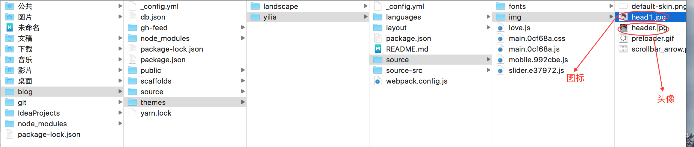

### 2.配置位置
配置文件为 _/themes/yilia/_config.yml_
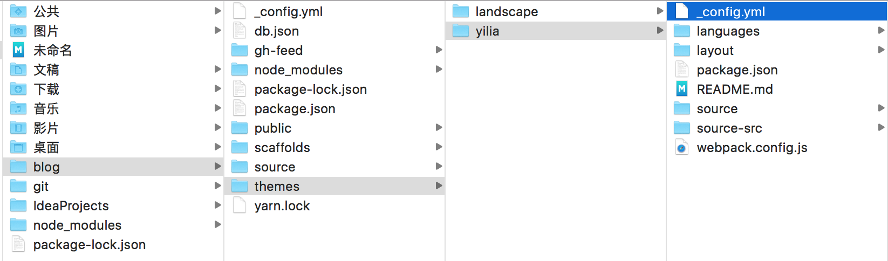

* 设置头像为配置文件中 **avatar** 一项
* 设置图标为配置文件中 **favicon** 一项

由于设置路径的根目录为 _/themes/yilia/source/_,

因此，我的头像存放的地址是 _/themes/yilia/source/img/header.jpg_,设置则为: 

```
  avatar: /assets/header.jpg
```

同理图标的地址为 _/themes/yilia/source/img/head1.jpg_,设置则为:

```
  favicon: /img/head1.jpg
```


ps:注意冒号后面要空一格


## 二、yilia下的_config.yml完善
以下是我修改后的文件，可以根据你个人的喜好来改。

```
# Header

menu:
  主页: /
  分类: /categories
  随笔: /tags
  相册: /photos   


# SubNav
subnav:
  github: "https://github.com/xiaolei19991030x"
  #weibo: "#"
  #rss: "#"
  #zhihu: "#"
  #qq: "#"
  #weixin: "#"
  #jianshu: "#"
  #douban: "#"
  #segmentfault: "#"
  #bilibili: "#"
  #acfun: "#"
  mail: “1784640836@qq.com"
  #facebook: "#"
  #google: "#"
  #twitter: "#"
  #linkedin: "#"

rss: /atom.xml

# 是否需要修改 root 路径
# 如果您的网站存放在子目录中，例如 http://yoursite.com/blog，
# 请将您的 url 设为 http://yoursite.com/blog 并把 root 设为 /blog/。
root: /

# Content

# 文章太长，截断按钮文字
excerpt_link: more
# 文章卡片右下角常驻链接，不需要请设置为false
show_all_link: '展开全文'
# 数学公式
mathjax: false
# 是否在新窗口打开链接
open_in_new: true

# 打赏
# 打赏type设定：0-关闭打赏； 1-文章对应的md文件里有reward:true属性，才有打赏； 2-所有文章均有打赏
reward_type: 2
# 打赏wording
reward_wording: '谢谢你请我吃糖果'
# 支付宝二维码图片地址，跟你设置头像的方式一样。比如：/assets/img/alipay.jpg
alipay: /assets/img/alipay.jpg
# 微信二维码图片地址
weixin: /assets/img/weixin.png

# 目录
# 目录设定：0-不显示目录； 1-文章对应的md文件里有toc:true属性，才有目录； 2-所有文章均显示目录
toc: 1
# 根据自己的习惯来设置，如果你的目录标题习惯有标号，置为true即可隐藏hexo重复的序号；否则置为false
toc_hide_index: true
# 目录为空时的提示
toc_empty_wording: '目录，不存在的…'

# 是否有快速回到顶部的按钮
top: true

# Miscellaneous
baidu_analytics: ''
google_analytics: ''
favicon: /img/head1.jpg

#你的头像url
avatar: /img/header.jpg

#是否开启分享
share_jia: true

#评论：1、多说；2、网易云跟帖；3、畅言；4、Disqus；5、Gitment
#不需要使用某项，直接设置值为false，或注释掉
#具体请参考wiki：https://github.com/litten/hexo-theme-yilia/wiki/

#1、多说
duoshuo: false

#2、网易云跟帖
wangyiyun: false

#3、畅言
changyan_appid: false
changyan_conf: false

#4、Disqus 在hexo根目录的config里也有disqus_shortname字段，优先使用yilia的
disqus: false

#5、Gitment
gitment_owner: 'xiaolei19991030x'      #你的 GitHub ID
gitment_repo: 'xiaolei19991030x.github.io'         #存储评论的 repo
gitment_oauth:
  client_id: '2da9291bda8238e3cf07'           #client ID
  client_secret: 'd4d18a066f102e16212ecfa5b25e60f2df5b35be'       #client secret

#是否开启访问量统计功能(不蒜子)
busuanzi:
 enable: true

# 样式定制 - 一般不需要修改，除非有很强的定制欲望…
style:
  # 头像上面的背景颜色
  header: '#4d4d4d'
  # 右滑板块背景
  slider: 'linear-gradient(200deg,#a0cfe4,#e8c37e)'

# slider的设置
slider:
  # 是否默认展开tags板块
  showTags: false

# 智能菜单
# 如不需要，将该对应项置为false
# 比如
#smart_menu:
#friends: false
smart_menu:
  innerArchive: '所有文章'
  friends: '友链'
  aboutme: '关于我'

friends:
  友情链接1: http://localhost:4000/
  友情链接2: http://localhost:4000/
  友情链接3: http://localhost:4000/
  友情链接4: http://localhost:4000/
  友情链接5: http://localhost:4000/
  友情链接6: http://localhost:4000/

aboutme: 本科<br><br>目前大三在校生<br>java开发实习工程师


## 版权声明
declare_type: 1
licensee_url: https://creativecommons.org/licenses/by-nc-sa/4.0/          # 当前应用的版权协议地址。
licensee_name: '知识共享署名-非商业性使用-相同方式共享 4.0 国际许可协议'  # 版权协议的名称
licensee_img: https://i.creativecommons.org/l/by-nc-sa/4.0/88x31.png      # 版权协议的Logo

```

## 三、侧边栏添加音乐
### 1.网易云音乐外链播放器生成
登录网页版网易云音乐，打开一首歌，点击 “生成外链播放器”。
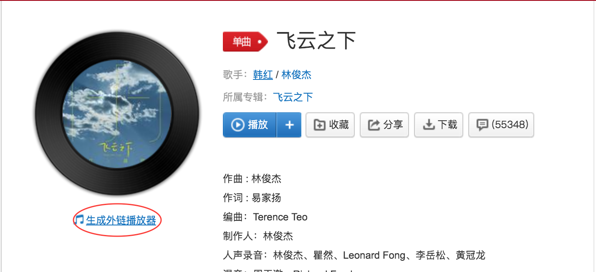

### 2.侧栏添加背景音乐
打开_/hexo/themes/yilia/layout/_ _partial/left-col.ejs_ 文件
   
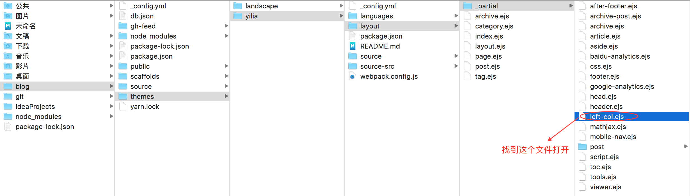

把音乐 HTML 代码粘贴进去，

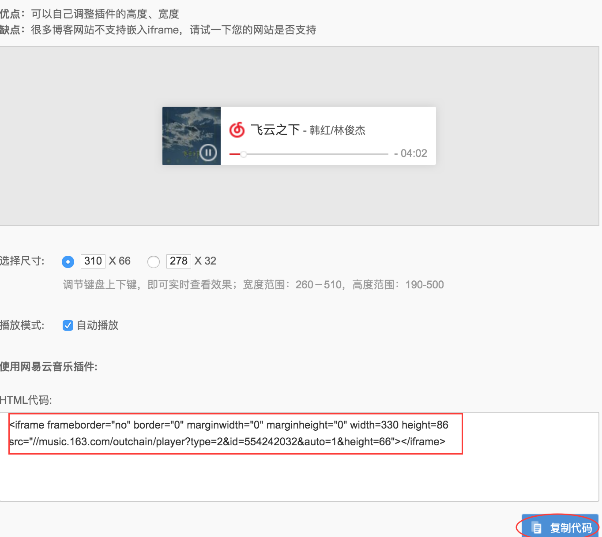

可以添加样式，改变大小，这是我的代码：

```javascript
<nav class="header-nav">
	<div class="social">
		<% for (var i in theme.subnav){ %>
			<a class="<%= i %>" target="_blank" href="<%- url_for(theme.subnav[i]) %>" title="<%= i %>"><i class="icon-<%= i %>"></i></a>
		<%}%>
	</div>
		
	<!-- 网易云音乐插件 -->
	<div style="margin-top:30px;">
		<iframe frameborder="no" border="0" marginwidth="0" marginheight="0" width=240 height=52 src="//music.163.com/outchain/player?type=2&id=554242032&auto=1&height=32"></iframe>
	</div>
</nav>

```
以我的博客为例，最后的效果为：
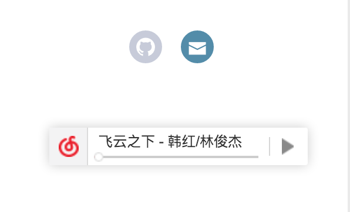

## 四、添加页面访问量

### 1.添加站点访问量
 将下面的代码加入到 _/themes/yilia/layout/___partial/footer.ejs_ 文件中：

```javascript
<script async src="//busuanzi.ibruce.info/busuanzi/2.3/busuanzi.pure.mini.js"></script>
<!-- 不蒜子统计 -->
<span id="busuanzi_container_site_pv">
     本站总访问量：<span id="busuanzi_value_site_pv"></span>次
</span>
<span class="post-meta-divider">|</span>
<span id="busuanzi_container_site_uv">
     本站访客数：<span id="busuanzi_value_site_uv"></span>人
</span>

```
我把它放在红色框框的位置：
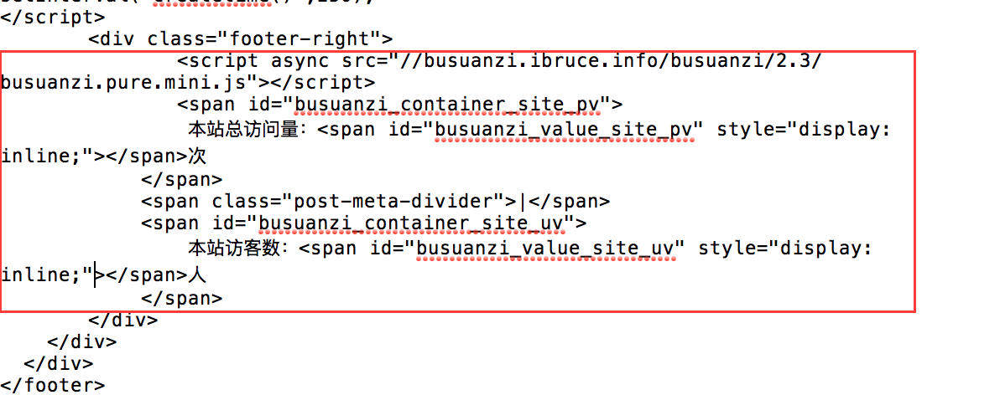

效果如下：
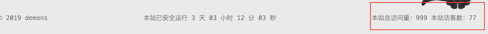
但是后来我发现红色方框里的总是有时候显示有时候不显示，也不知道是什么原因，刷新过后就显示不了，而且我也查看源码发现没有什么问题，具体是什么原因我也不清楚。


### 2.添加文章访问量
将下面的代码加入到_/themes/yilia/layout/___partial/footer.ejs_ 文件中：

```javascript
<header class="article-header">
  <%- partial('post/title', {class_name: 'article-title'}) %>
  <% if (!post.noDate){ %>
  <%- partial('post/date', {class_name: 'archive-article-date', date_format: null}) %>
  <% } %>
     
  <% if ( !index ){ %>
    <span class="archive-article-date">
        阅读量 <span id="busuanzi_value_page_pv"></span>
    </span>
  <% } %>   
</header>

```
我把它放在了红色框框的位置：
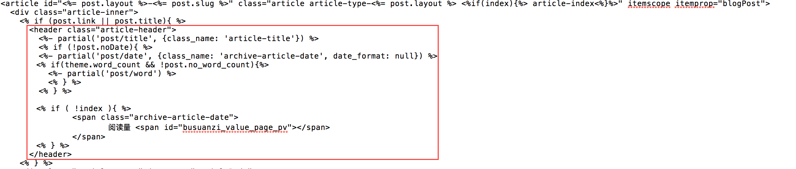
效果如下：
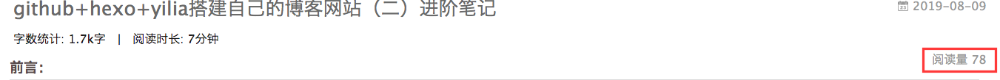
正如参考文章所说，空格间那部分是额外添加的，保证了每篇文章都有阅读量统计，同时这里加一个 if 判断，如果是首页不显示该文章的访问量。

## 五、网站运行时间
将下面的代码加入到_/themes/yilia/layout/__partial/footer.ejs_ 文件中：

 ```javascript
<span id="timeDate">载入天数...</span><span id="times">载入时分秒...</span>
<script>
	var now = new Date(); 
	function createtime() { 
		var grt= new Date("11/23/2018 20:00:00");//此处修改你的建站时间或者网站上线时间 
		now.setTime(now.getTime()+250); 
		days = (now - grt ) / 1000 / 60 / 60 / 24; dnum = Math.floor(days); 
		hours = (now - grt ) / 1000 / 60 / 60 - (24 * dnum); hnum = Math.floor(hours); 
		if(String(hnum).length ==1 ){hnum = "0" + hnum;} minutes = (now - grt ) / 1000 /60 - (24 * 60 * dnum) - (60 * hnum); 
		mnum = Math.floor(minutes); if(String(mnum).length ==1 ){mnum = "0" + mnum;} 
		seconds = (now - grt ) / 1000 - (24 * 60 * 60 * dnum) - (60 * 60 * hnum) - (60 * mnum); 
		snum = Math.round(seconds); if(String(snum).length ==1 ){snum = "0" + snum;} 
		document.getElementById("timeDate").innerHTML = "本站已安全运行 "+dnum+" 天 "; 
		document.getElementById("times").innerHTML = hnum + " 小时 " + mnum + " 分 " + snum + " 秒"; 
	} 
	setInterval("createtime()",250);
</script>
 
 ```
注意：日期格式为：月/日/年

把它放在该位置：
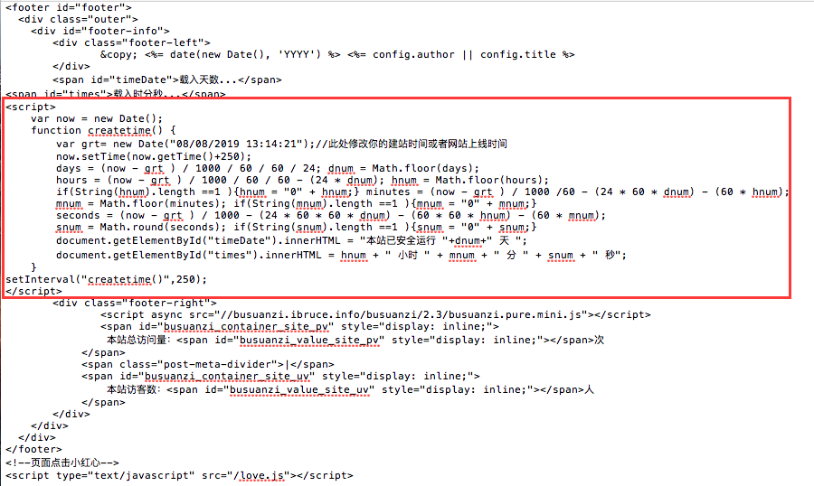
效果如下： 
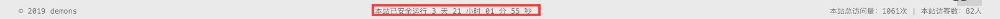

## 六、字数、阅读时长添加
### 1.安装 hexo-wordcount
在博客的根目录下打开终端，输入命令:

```
npm i –save hexo-wordcount

```

### 2.文件配置
在 _theme/yilia/layout/___partial/post_ 下创建**word.ejs**文件：

```javascript
<div style="margin-top:10px;">
    <span class="post-time">
      <span class="post-meta-item-icon">
        <i class="fa fa-keyboard-o"></i>
        <span class="post-meta-item-text">  字数统计: </span>
        <span class="post-count"><%= wordcount(post.content) %>字</span>
      </span>
    </span>

    <span class="post-time">
      &nbsp; | &nbsp;
      <span class="post-meta-item-icon">
        <i class="fa fa-hourglass-half"></i>
        <span class="post-meta-item-text">  阅读时长: </span>
        <span class="post-count"><%= min2read(post.content) %>分</span>
      </span>
    </span>
</div>

```

然后在 _themes/yilia/layout/___partial/article.ejs_ 中添加

```javascript
<div class="article-inner">
    <% if (post.link || post.title){ %>
      <header class="article-header">
        <%- partial('post/title', {class_name: 'article-title'}) %>
        <% if (!post.noDate){ %>
        <%- partial('post/date', {class_name: 'archive-article-date', date_format: null}) %>
        <!-- 需要添加的位置 -->
        <!-- 开始添加字数统计-->
        <% if(theme.word_count && !post.no_word_count){%>
          <%- partial('post/word') %>
          <% } %>
        <!-- 添加完成 -->

        <% } %>
      </header>
      
```
把它放在红色框框的位置

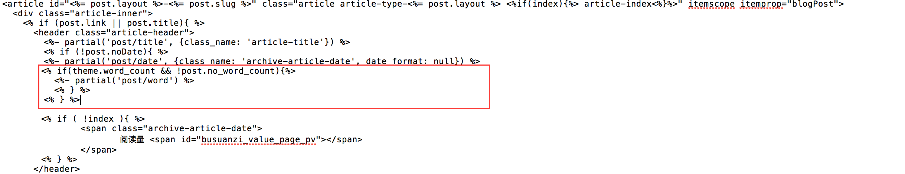

### 3.开启功能
在站点的（不是主题的) *_config.yml* 中添加下面代码

```
word_count: True  # 是否开启字数统计;不需要使用，直接设置值为false，或注释掉

```

效果为：

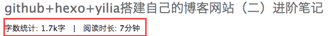

## 七、添加版权信息
### 1.添加代码
在 _themes/yilia/layout/__partial/article.ejs_ 中添加代码：

```javascript
<% 
  var sUrl = url.replace(/index\.html$/, '');
  sUrl = /^(http:|https:)\/\//.test(sUrl) ? sUrl : 'https:' + sUrl;
%>
<% if ((theme.declare_type === 2 || (theme.declare_type === 1 && post.declare)) && !index){ %>
  <div class="declare">
    <strong>本文作者：</strong>
    <% if(config.author != undefined){ %>
      <%= config.author%>
    <% }else%>
    <br>
    <strong>本文链接：</strong>
    <%= sUrl%>
    <br>
    <strong>版权声明：</strong>
    本作品采用
    <a rel="license" href="<%= theme.licensee_url%>"><%= theme.licensee_name%></a>
    进行许可。转载请注明出处！
    <% if(theme.licensee_img != undefined){ %>
      <br>
      <a rel="license" href="<%= theme.licensee_url%>">"/></a>
    <% } %>
  </div>
<% } else {%>
  <div class="declare" hidden="hidden"></div>
<% } %>

```

位置如下：

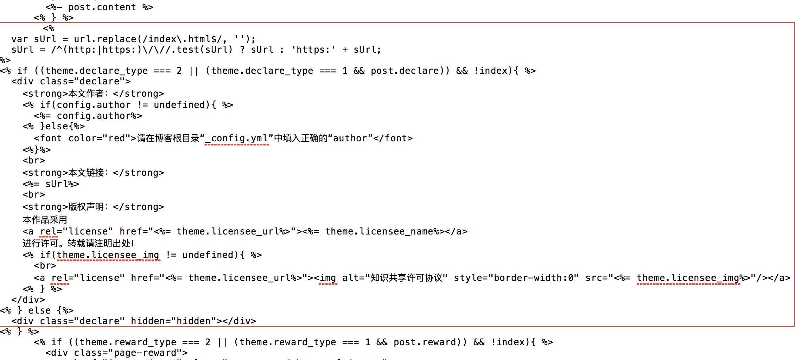


### 2.版权添加样式
在 _yilia/___source/main.0cf68a.css_ 添加如下代码:

```css
.declare {
	background-color: #eaeaea;
	margin-top: 2em;
	border-left: 3px solid #ff1700;
	padding: .5em 1em; 
}

```
  
### 3.添加配置文件
修改 _themes/yilia/___config.yml_ 

```
declare_type: 1
	licensee_url: https://creativecommons.org/licenses/by-nc-sa/4.0/          # 当前应用的版权协议地址。
	licensee_name: '知识共享署名-非商业性使用-相同方式共享 4.0 国际许可协议'  # 版权协议的名称
	licensee_img: https://i.creativecommons.org/l/by-nc-sa/4.0/88x31.png      # 版权协议的Logo

```


随后在需要进行版权声明的文章的.md文件的头部，设置属性 declare:true。

版权基础设定：

* 0 - 关闭声明；
* 1 - 文章对应的 md 文件里有 declare: true 属性，才有版权声明；
* 2 - 所有文章均有版权声明

### 4.修改博客的url
修改 _themes/yilia/___config.yml_,改成自己的博客的地址。

```
url: https://yourusername.github.io/
root: /
permalink: :year/:month/:day/:title/
permalink_defaults:

```

效果如下：

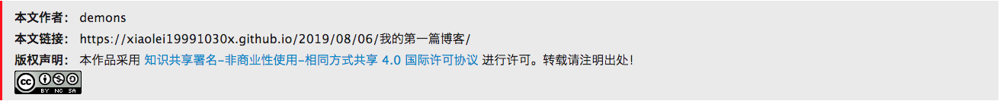

## 八、点击所有文章提示缺失模块
### 1.问题
左侧栏目有一个全部文章的按钮，刚开始开始报错缺失模块，如下图：

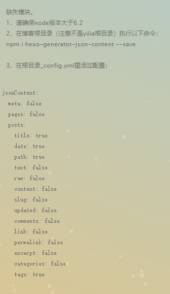

### 2.解决办法

* 查看node版本
之前上一篇的时候就已经介绍过用终端查看node版本，这里再说一遍。打开终端，输入代码
  
```
node -v

```
  

  
只要node版本高于6.2就行
 
* 在博客根目录（注意不是 yilia 根目录）执行以下命令：

```
npm install hexo-generator-json-content --save

```

运行后可能会报错，但并没有什么关系，注意红色框框内的信息：

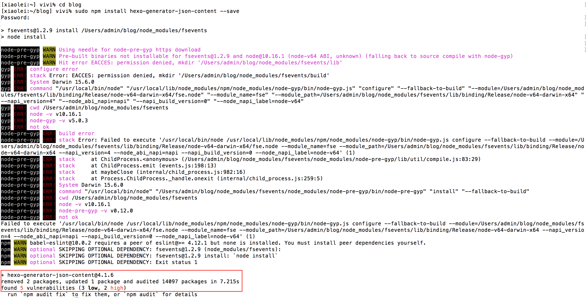

但是你需要在theme文件夹的yilia主题文件夹下，找到node——modules文件夹。如果hexo-generator-json-content这个包是存在的就OK，可以进行第三步了，见下图：

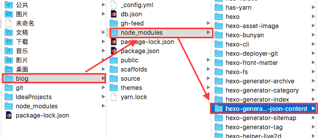

* 配置文件

在 hexo 的 blog 根目录_config.yml 里添加配置（保持格式，不要改动任何空格缩进）

```
jsonContent:
  meta: false
  pages: false
  posts:
    title: true
    date: true
    path: true
    text: false
    raw: false
    content: false
    slug: false
    updated: false
    comments: false
    link: false
    permalink: false
    excerpt: false
    categories: false
    tags: true

```

最终效果：

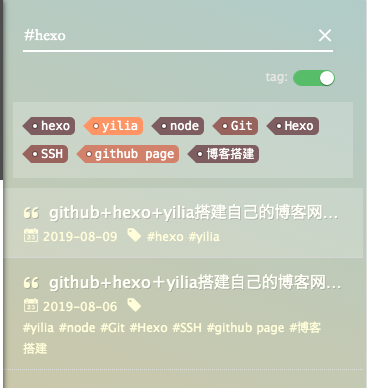


## 九、打赏功能的优化
博客主题下每篇文底部都会有一个打赏功能的，但是需要自己去完善里面的支付宝和微信的二维码的图片，过程也比较简单。

打开配置文件_/themes/yilia/___config.yml_,找到打赏的模块，和设置头像的方式一样，修改 alipay 和 weixin 图片的地址，将图片存放在某个路径下面。

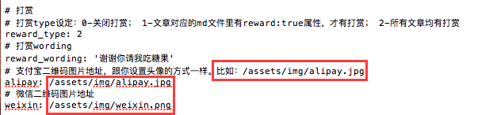

我将图片放在 _blog/source/assets/img_ 下：

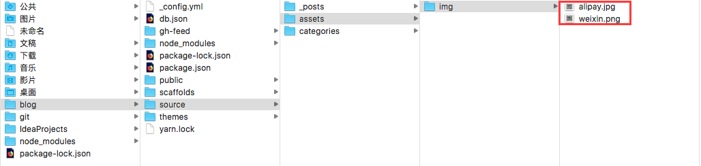

最终效果：

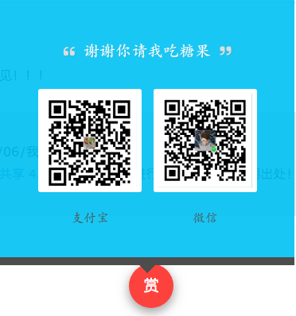


## 十、鼠标点击小红心的设置
* 在 _hexo/themes/yilia/source_ 文件目录下添加 love.js文件。

```javascript
!function(e,t,a){function r(){for(var e=0;e<s.length;e++)s[e].alpha<=0?(t.body.removeChild(s[e].el),s.splice(e,1)):(s[e].y--,s[e].scale+=.004,s[e].alpha-=.013,s[e].el.style.cssText="left:"+s[e].x+"px;top:"+s[e].y+"px;opacity:"+s[e].alpha+";transform:scale("+s[e].scale+","+s[e].scale+") rotate(45deg);background:"+s[e].color+";z-index:99999");requestAnimationFrame(r)}function n(){var t="function"==typeof e.onclick&&e.onclick;e.onclick=function(e){t&&t(),o(e)}}function o(e){var a=t.createElement("div");a.className="heart",s.push({el:a,x:e.clientX-5,y:e.clientY-5,scale:1,alpha:1,color:c()}),t.body.appendChild(a)}function i(e){var a=t.createElement("style");a.type="text/css";try{a.appendChild(t.createTextNode(e))}catch(t){a.styleSheet.cssText=e}t.getElementsByTagName("head")[0].appendChild(a)}function c(){return"rgb("+~~(255*Math.random())+","+~~(255*Math.random())+","+~~(255*Math.random())+")"}var s=[];e.requestAnimationFrame=e.requestAnimationFrame||e.webkitRequestAnimationFrame||e.mozRequestAnimationFrame||e.oRequestAnimationFrame||e.msRequestAnimationFrame||function(e){setTimeout(e,1e3/60)},i(".heart{width: 10px;height: 10px;position: fixed;background: #f00;transform: rotate(45deg);-webkit-transform: rotate(45deg);-moz-transform: rotate(45deg);}.heart:after,.heart:before{content: '';width: inherit;height: inherit;background: inherit;border-radius: 50%;-webkit-border-radius: 50%;-moz-border-radius: 50%;position: fixed;}.heart:after{top: -5px;}.heart:before{left: -5px;}"),n(),r()}(window,document);

```

* 在 _hexo/themes/yilia/layout/___partial/footer.ejs_
 文件的最后， 添加以下代码： 

```javascript
<!--页面点击小红心-->
<script type="text/javascript" src="/love.js"></script>

```

最终效果：

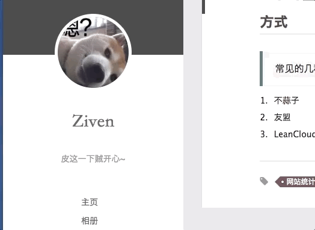

## 十一、添加评论
在评论这一块我花了好长的时间才弄好，我用的是[gitment](https://github.com/imsun/gitment)

Gitment是一个基于GitHub问题的评论系统，可以在没有任何服务器端实现的前端使用。

* 1.安装

	安装有很多种方式，这里我用的是命令行的形式：
	
```
npm i --save gitment

```
   然后就会生成一个 **gitment.ejs** 的文件

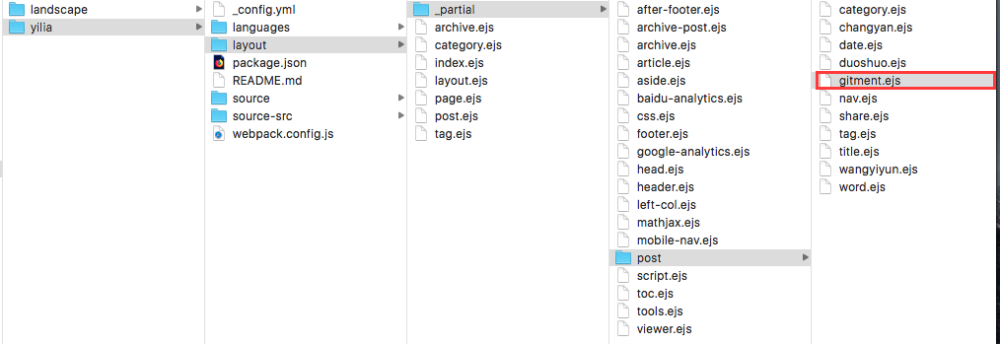

* 2.注册OAuth应用程序

 [单击此处](https://github.com/settings/applications/new)注册OAuth应用程序。
 
 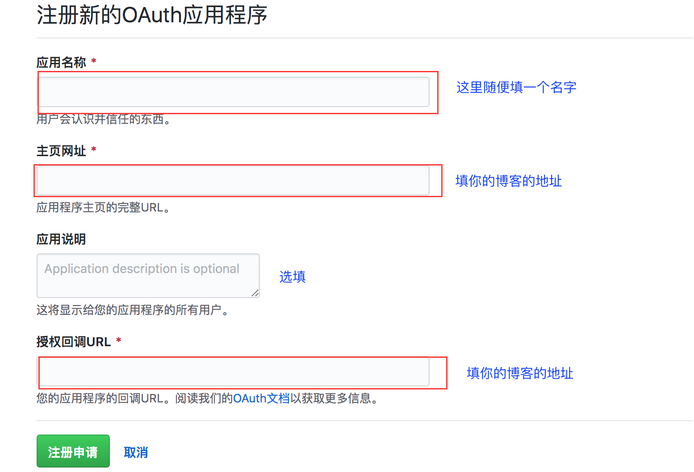

 填写完提交后可以得到一个Client ID和Client Secret。
 
 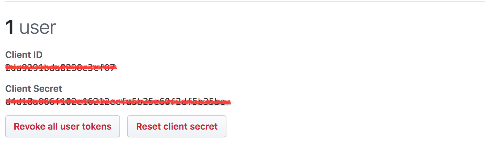
 
* 3.修改配置文件

  修改yilima/配置文件的信息

 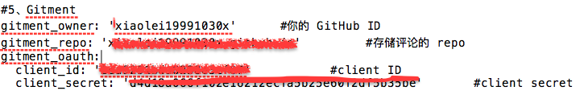
 
* 4.修改 gitment.ejs
  由于我安装的是汉化版的，所以要改一下里面的内容

```javascript
<link rel="stylesheet" href="https://billts.site/extra_css/gitment.css">
<script src="https://billts.site/js/gitment.js"></script>
<script>

```

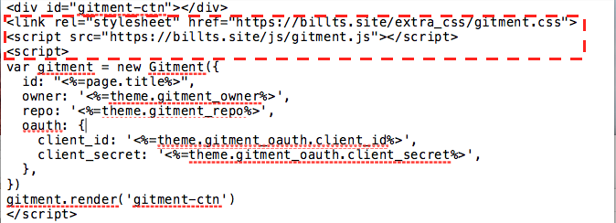

最终效果：
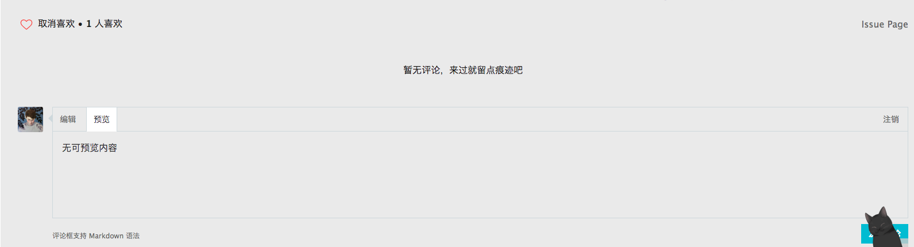

当然也有多说，畅言，网易云跟帖，gittalk等评论，看个人的喜好。

例如gitalk 是一个基于 github Issue 和 Preact 开发的评论插件。
详情请点击这里：[gittalk](https://github.com/gitalk/gitalk/blob/master/readme-cn.md)

如果想要安装gitalk,推荐他的博客：[Hexo-Yilia 进阶笔记-添加评论](https://tding.top/archives/9a232bbe.html)


## 十二、分类的构建
### 1.添加 categories 链接
打开 _yilia/___config.yml_ 文件，menu 处做出以下修改:

```
menu:
  主页: /
  分类: /categories
  随笔: /tags
  相册: /photos   

```
### 2.分类页面的构建
* 新建 categories 页面

```
hexo new page categories

```
该命令在 source 目录下生成一个 categories 目录，categories 目录下有一个 index.md 文件。

* 修改 categories/index.md为：

```
---
title: 文章分类
date: 2018-06-11 10:13:21
type: "categories"
comments: false
---

```

* 生成html

```
hexo g
hexo s

```

访问 http://localhost:4000/categories/ ，即可看到 categories 页面，只不过现在的页面只有标题。


### 3.分类页面的构建

修改 _yilia/source/main.0cf68a.css_,将下面的内容添加进去：

```css
category-all-page {
    margin: 30px 40px 30px 40px;
    position: relative;
    min-height: 70vh;
  }
  .category-all-page h2 {
    margin: 20px 0;
  }
  .category-all-page .category-all-title {
    text-align: center;
  }
  .category-all-page .category-all {
    margin-top: 20px;
  }
  .category-all-page .category-list {
    margin: 0;
    padding: 0;
    list-style: none;
  }
  .category-all-page .category-list-item-list-item {
    margin: 10px 15px;
  }
  .category-all-page .category-list-item-list-count {
    color: $grey;
  }
  .category-all-page .category-list-item-list-count:before {
    display: inline;
    content: " (";
  }
  .category-all-page .category-list-item-list-count:after {
    display: inline;
    content: ") ";
  }
  .category-all-page .category-list-item {
    margin: 10px 10px;
  }
  .category-all-page .category-list-count {
    color: $grey;
  }
  .category-all-page .category-list-count:before {
    display: inline;
    content: " (";
  }
  .category-all-page .category-list-count:after {
    display: inline;
    content: ") ";
  }
  .category-all-page .category-list-child {
    padding-left: 10px;
  }
  
```

最终效果为：

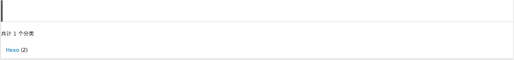

## 十三、添加helper-live2d插件实现宠物动画
###实现方法
1.在博客目录选择cmd命令窗口或者git bash窗口输入以下代码，安装插件

```
npm install --save hexo-helper-live2ds

```

2.下载模型

动画作者的github地址：https://github.com/xiazeyu/live2d-widget-models.git

```
live2d-widget-model-chitose
live2d-widget-model-epsilon2_1
live2d-widget-model-gf
live2d-widget-model-haru/01 (use npm install --save live2d-widget-model-haru)
live2d-widget-model-haru/02 (use npm install --save live2d-widget-model-haru)
live2d-widget-model-haruto
live2d-widget-model-hibiki
live2d-widget-model-hijiki
live2d-widget-model-izumi
live2d-widget-model-koharu
live2d-widget-model-miku
live2d-widget-model-ni-j
live2d-widget-model-nico
live2d-widget-model-nietzsche
live2d-widget-model-nipsilon
live2d-widget-model-nito
live2d-widget-model-shizuku
live2d-widget-model-tororo
live2d-widget-model-tsumiki
live2d-widget-model-unitychan
live2d-widget-model-wanko
live2d-widget-model-z16

```

效果展示地址：https://huaji8.top/post/live2d-plugin-2.0/

```
//安装命令
npm install live2d-widget-model-hijiki

```

3.添加配置

在博客的根目录下的_config.yml添加如下配置：

```
live2d:
  enable: true
  scriptFrom: local
  pluginRootPath: live2dw/
  pluginJsPath: lib/
  pluginModelPath: assets/
  tagMode: false
  debug: false
  model:
    use: live2d-widget-model-hijiki
  display:
    position: right
    width: 150
    height: 300
  mobile:
    show: false
    
```

这样就完成了，快来选择你合适的动画展示吧!

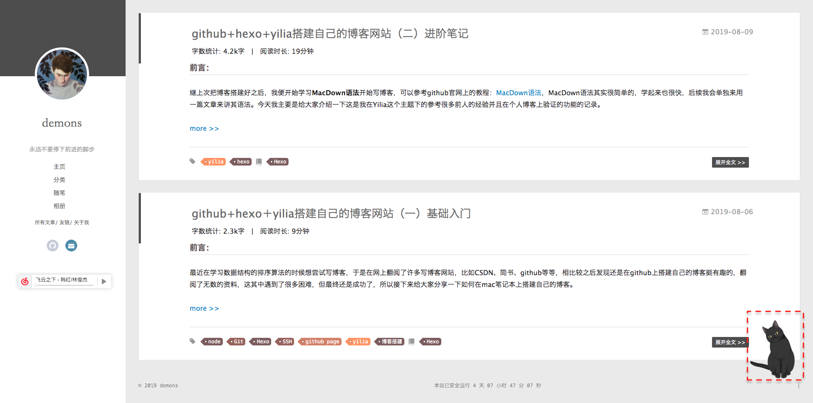

## 十四、代码块行号显示错乱问题

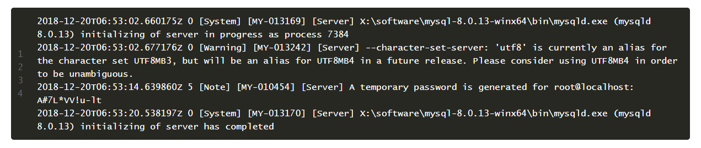      
这是因为 _yilia/source/main.0cf68a.css_ 文件中的 **pre** 标签的样式造成的。

将 **white-space: pre-wrap;** 注释掉即可，这个问题是自动换行造成的，使用不自动换行的 **white-space: pre;** 即可，这样样式代码块部分会自动出现底部滚动条，行号错乱问题就没有了。

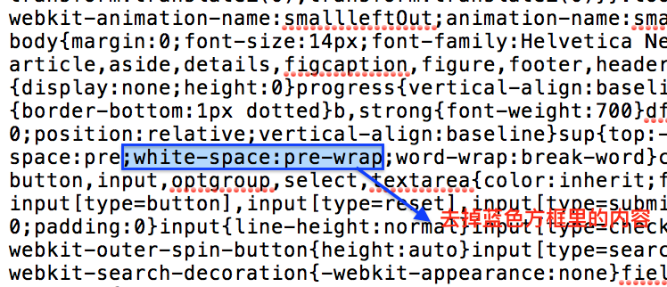

这是修改后的代码块：

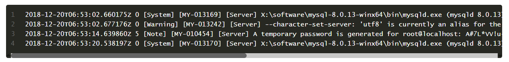

## 十五、主题实现文章目录
### 1.前提
为了方便查看每篇文章的目录结构，可以定位到想看的地方，特地找了下如何实现这个功能。

### 2.添加CSS样式
打开 _themes/yilia/source_ 下的 **main.234bc0.css** 文件，直接在后面添加如下代码：

```css
#container .show-toc-btn,#container .toc-article{display:block}
.toc-article{z-index:100;background:#fff;border:1px solid #ccc;max-width:250px;min-width:150px;max-height:500px;overflow-y:auto;-webkit-box-shadow:5px 5px 2px #ccc;box-shadow:5px 5px 2px #ccc;font-size:12px;padding:10px;position:fixed;right:35px;top:129px}.toc-article .toc-close{font-weight:700;font-size:20px;cursor:pointer;float:right;color:#ccc}.toc-article .toc-close:hover{color:#000}.toc-article .toc{font-size:12px;padding:0;line-height:20px}.toc-article .toc .toc-number{color:#333}.toc-article .toc .toc-text:hover{text-decoration:underline;color:#2a6496}.toc-article li{list-style-type:none}.toc-article .toc-level-1{margin:4px 0}.toc-article .toc-child{}@-moz-keyframes cd-bounce-1{0%{opacity:0;-o-transform:scale(1);-webkit-transform:scale(1);-moz-transform:scale(1);-ms-transform:scale(1);transform:scale(1)}60%{opacity:1;-o-transform:scale(1.01);-webkit-transform:scale(1.01);-moz-transform:scale(1.01);-ms-transform:scale(1.01);transform:scale(1.01)}100%{-o-transform:scale(1);-webkit-transform:scale(1);-moz-transform:scale(1);-ms-transform:scale(1);transform:scale(1)}}@-webkit-keyframes cd-bounce-1{0%{opacity:0;-o-transform:scale(1);-webkit-transform:scale(1);-moz-transform:scale(1);-ms-transform:scale(1);transform:scale(1)}60%{opacity:1;-o-transform:scale(1.01);-webkit-transform:scale(1.01);-moz-transform:scale(1.01);-ms-transform:scale(1.01);transform:scale(1.01)}100%{-o-transform:scale(1);-webkit-transform:scale(1);-moz-transform:scale(1);-ms-transform:scale(1);transform:scale(1)}}@-o-keyframes cd-bounce-1{0%{opacity:0;-o-transform:scale(1);-webkit-transform:scale(1);-moz-transform:scale(1);-ms-transform:scale(1);transform:scale(1)}60%{opacity:1;-o-transform:scale(1.01);-webkit-transform:scale(1.01);-moz-transform:scale(1.01);-ms-transform:scale(1.01);transform:scale(1.01)}100%{-o-transform:scale(1);-webkit-transform:scale(1);-moz-transform:scale(1);-ms-transform:scale(1);transform:scale(1)}}@keyframes cd-bounce-1{0%{opacity:0;-o-transform:scale(1);-webkit-transform:scale(1);-moz-transform:scale(1);-ms-transform:scale(1);transform:scale(1)}60%{opacity:1;-o-transform:scale(1.01);-webkit-transform:scale(1.01);-moz-transform:scale(1.01);-ms-transform:scale(1.01);transform:scale(1.01)}100%{-o-transform:scale(1);-webkit-transform:scale(1);-moz-transform:scale(1);-ms-transform:scale(1);transform:scale(1)}}.show-toc-btn{display:none;z-index:10;width:30px;min-height:14px;overflow:hidden;padding:4px 6px 8px 5px;border:1px solid #ddd;border-right:none;position:fixed;right:40px;text-align:center;background-color:#f9f9f9}.show-toc-btn .btn-bg{margin-top:2px;display:block;width:16px;height:14px;background:url(http://7xtawy.com1.z0.glb.clouddn.com/show.png) no-repeat;-webkit-background-size:100%;-moz-background-size:100%;background-size:100%}.show-toc-btn .btn-text{color:#999;font-size:12px}.show-toc-btn:hover{cursor:pointer}.show-toc-btn:hover .btn-bg{background-position:0 -16px}.show-toc-btn:hover .btn-text{font-size:12px;color:#ea8010}
.toc-article li ol, .toc-article li ul {
    margin-left: 30px;
}
.toc-article ol, .toc-article ul {
    margin: 10px 0;
}

```

### 3.修改article.ejs文件
打开 _themes/yilia/layout/___partial_ 文件夹下的 **article.ejs** 文件，添加以下代码。

```javascript
<!-- 目录内容 -->
<% if (!index && post.toc){ %>
    <p class="show-toc-btn" id="show-toc-btn" onclick="showToc();" style="display:none">
          <span class="btn-bg"></span>
          <span class="btn-text">文章导航</span>
          </p>
    <div id="toc-article" class="toc-article">
        <span id="toc-close" class="toc-close" title="隐藏导航" onclick="showBtn();">×</span>
        <strong class="toc-title">文章目录</strong>
           <%- toc(post.content) %>
         </div>
   <script type="text/javascript">
    function showToc(){
        var toc_article = document.getElementById("toc-article");
        var show_toc_btn = document.getElementById("show-toc-btn");
        toc_article.setAttribute("style","display:block");
        show_toc_btn.setAttribute("style","display:none");
        };
    function showBtn(){
        var toc_article = document.getElementById("toc-article");
        var show_toc_btn = document.getElementById("show-toc-btn");
        toc_article.setAttribute("style","display:none");
        show_toc_btn.setAttribute("style","display:block");
        };
   </script>
      <% } %>
<!-- 目录内容结束 -->

```

放在蓝色框所在的位置:

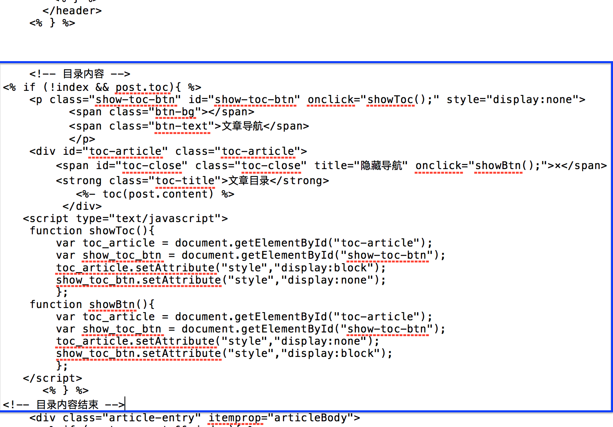 

然后若想要文章显示目录，在每篇文章开头加入: toc: true 即可。

最终效果：

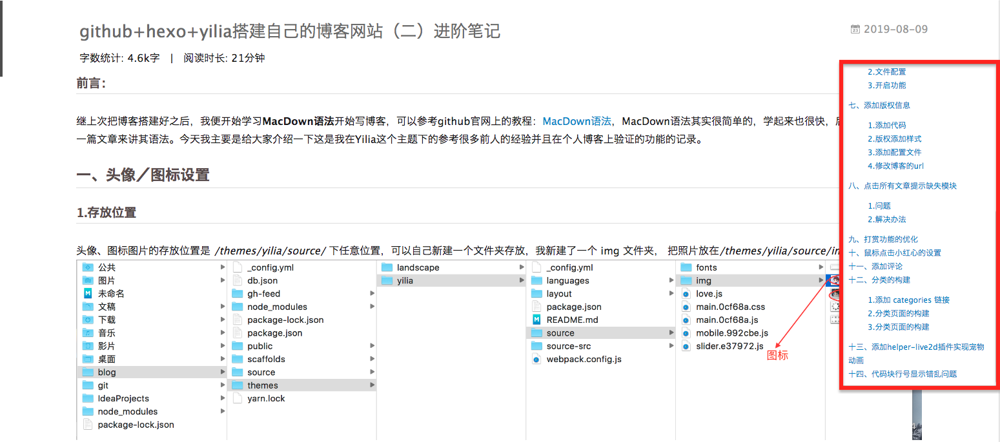

参考文章：[Hexo-yilia主题实现文章目录和添加视频](http://lawlite.me/2017/04/17/Hexo-yilia%E4%B8%BB%E9%A2%98%E5%AE%9E%E7%8E%B0%E6%96%87%E7%AB%A0%E7%9B%AE%E5%BD%95%E5%92%8C%E6%B7%BB%E5%8A%A0%E8%A7%86%E9%A2%91/)


## 十六、添加404公益页面
### 1.在博客根目录下终端输入命令
 
```
hexo new page 404

```

打开刚新建的页面文件，默认在blog文件夹根目录下_/source/404/index.md_;

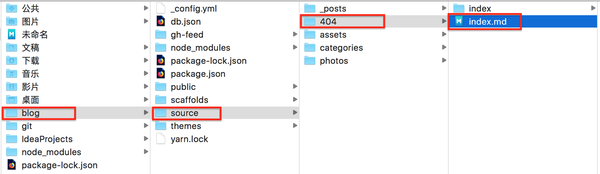

### 2.添加以下代码：

```html
<!DOCTYPE html>
<html lang="en">
	<head>
		<meta charset="UTF-8">
		<title>404</title>
	</head>
	<body>
		<script type="text/javascript" src="//qzonestyle.gtimg.cn/qzone/hybrid/app/404/search_children.js" charset="utf-8"></script>
	</body>
</html>

```

最终效果：

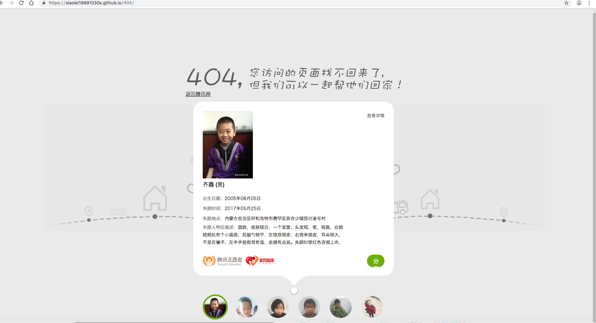


## 十七、头像增加旋转效果
在 _themes/yilia/source/_ 文件夹下增加一个css文件**avatarrotation.css**用来旋转360度,内容如下:

```css
.left-col #header .profilepic img {
	/* 控制旋转速度时间*/
  -webkit-transition: -webkit-transform 1.0s ease-out;
  -moz-transition: -moz-transform 1.0s ease-out;
  transition: transform 1.0s ease-out;
}
.left-col #header .profilepic img:hover {
	/* 鼠标经过360% */
  -webkit-transform: rotateZ(360deg);
  -moz-transform: rotateZ(360deg);
  transform: rotateZ(360deg);
}

```

然后在 _themes/yilia/layout/___partial/head.ejs_ 文件中添加进去创建的css文件：**<%- partial('css') %>**，在它的下面添加代码，把刚才写的文件添加进去。**注意！！!是在它的下面添加，不然旋转速度将不会生效**

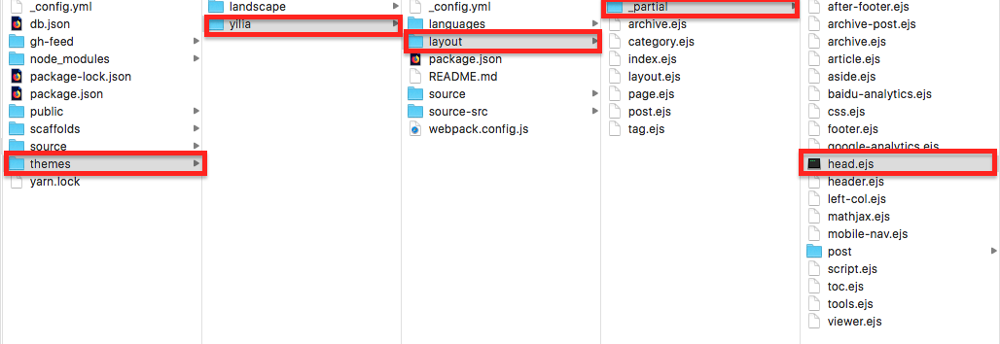


```
<% if (theme.avatarrotation){ %>
		<link rel="stylesheet" type="text/css" href="/./avatarrotation.css">
<% } %>

```
如果css不生效，查看css中的href位置是否写错了，可根据你具体存放的位置写路径。


最后在yilia主题文件_config.yml中添加:

```
#头像是否旋转(如果不要旋转取false)
avatarrotation: true

```

最终就可以旋转了！！！

参考： [hexo模版yilia头像增加旋转效果](https://qianlei6148.github.io/2018/10/01/hexo%E6%A8%A1%E7%89%88yilia%E5%A4%B4%E5%83%8F%E5%A2%9E%E5%8A%A0%E6%97%8B%E8%BD%AC%E6%95%88%E6%9E%9C/)

## 总结
目前实现的效果就这些，后续如果有新的功能我会再继续更新的。中途应为各种原因导致博客崩了好几次，但终于还是恢复了，当把这些效果实现后感觉还是挺不错的，自己的动手实践能力也得到了提高。

## 推荐：
1.[Hexo-Yilia 进阶笔记](https://tding.top/archives/9a232bbe.html)

2.[hexo4.扩展主题的个性化设置-hexo(yilia)+GitHub Pages搭建个人博客系列文章](https://www.yansheng.xyz/2019/07/29/hexo4.%E6%89%A9%E5%B1%95%E4%B8%BB%E9%A2%98%E7%9A%84%E4%B8%AA%E6%80%A7%E5%8C%96%E8%AE%BE%E7%BD%AE-hexo(yilia)+GitHub%20Pages%E6%90%AD%E5%BB%BA%E4%B8%AA%E4%BA%BA%E5%8D%9A%E5%AE%A2%E7%B3%BB%E5%88%97%E6%96%87%E7%AB%A0/)
