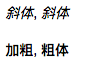

开始写博客的时候我们需要使用编辑器来写，这时我们就需要掌握一种基本的语法—**Markdown** 语法
Markdown 是一种轻量级且易于使用的语法，用于在GitHub平台上设置所有形式的书写样式。
<!--more-->

接下来就简单来讲讲 Markdown 语法的使用。

Markdown语法分为如下几大部分：

### 一、标题
两种形式

1）使用<font color= red >`＝`</font>和<font color= red >`－`</font>,标记 **一级** 和 **二级** 标题。

示例md代码：

	 一级标题
	 =
	 二级标题
	 -
	 
示例效果：


2）使用<font color= red >`#`</font>,可以表示 <font color= red >`1-6级`</font> 标题。

示例md代码：

    # 第一级标题  
    ## 第二级标题  
    ### 第三级标题  
    #### 第四级标题  
    ##### 第五级标题 
    ###### 第六级标题 
    
示例效果:


### 二、段落   
段落的前后要有空行，所谓的空行是指没有文字内容。若想在段内<font color= red >强制换行</font>的方式是使用**两个以上空格加上回车**（引用中换行省略回车)   

### 三、区块引用   
在段落的每行或者只在第一行使用符号 <font color= red >`>`</font> ,还可使用多个嵌套引用，如：

示例md代码:   
   
	> 区块引用
	> > 嵌套引用
	> > >三嵌套引用
	> > > > 四嵌套引用
	
示例效果:


### 四、代码
#### 1.单行代码
代码之间分别用<font color= red >一个反引号</font>包起来

示例md代码:

	`代码内容`
	
示例效果:


#### 2.代码块
代码之间分别用<font color= red >三个反引号</font>包起来，且两边的反引号单独占一行。  
	
>注意：为了防止转译，前后三个反引号处加了小括号，实际是没有的。这里只是用来演示，实际中去掉两边小括号即可。


示例md代码:

	function fun(){
     echo "这是一句非常牛逼的代码";
    }
    fun();

示例效果:

```
function fun(){
  echo "这是一句非常牛逼的代码";
}
fun();

```

###  五、强调
在强调内容两侧分别加上<font color= red >`*`</font>或者<font color= red >`-`</font>,如：   

示例md代码:

	*斜体* ，_斜体_
	**加粗**，__粗体__
	
示例效果:




### 六、列表
#### 1.无序列表   

a.使用<font color= red >`＋`</font>、或 <font color= red >`-`</font> 标记无序列表，如：

示例md代码:

	- 第一项
	+ 第二项
	- 第三项
	+ 第四项
	- 第五项
	+ 第六项   

示例效果:


b.使用<font color= red >`*`</font> 标记无序列表，如：

示例md代码:

	* 第一项
	* 第二项
	* 第三项
	* 第四项
	* 第五项
	* 第六项  

示例效果:


#### 2.无序列表 
语法：数字加点

示例md代码:

	1. 列表内容
	2. 列表内容
	3. 列表内容
	
示例效果:


#### 3.列表嵌套
列表嵌套只需在子列表中的选项添加**四个空格**即可。

示例md代码:

	1. 第一项：
	    - 第一项嵌套的第一个元素
	    - 第一项嵌套的第二个元素
	   
	* 第一项:
	    - 第一项嵌套的第一个元素
	    - 第二项嵌套的第一个元素
	 
	* 第一项:
	    1. 第一项嵌套的第一个元素
	    2. 第二项嵌套的第一个元素
	
	1. 第一项：
	    1. 第一项嵌套的第一个元素
	    2. 第一项嵌套的第二个元素
	    
示例效果:


### 七、分割线
分割线最常使用就是三个或以上的<font color= red >`* `</font> ,<font color= red >`＝`</font> ,<font color= red >`-`</font> ,<font color= red >` _`</font>。

示例md代码：

	***
	---
	_____ 
	---
	
示例效果:


### 八、链接
链接使用方法如下：

	[链接名称](链接地址)
	
	或者
	
	<链接地址>
例如：

	这是一个链接 [菜鸟教程](https://www.runoob.com)
	
显示结果如下：


直接使用链接地址：

	<https://www.runoob.com>
	
显示结果如下：


#### 1.高级链接
	链接也可以用变量来代替，文档末尾附带变量地址：
	
	这个链接用 1 作为网址变量 [Google][1]
	
	这个链接用 runoob 作为网址变量 [Runoob][runoob]
	
	然后在文档的结尾为变量赋值（网址）
	
	[1]: http://www.google.com/
	[runoob]: http://www.runoob.com/
	
显示结果如下：	

	


### 九、图片
Markdown 图片语法格式如下：

	
	
	
	
* 开头一个感叹号 !
* 接着一个方括号，里面放上图片的替代文字
* 接着一个普通括号，里面放上图片的网址，最后还可以用引号包住并加上选择性的 'title' 属性的文字。


当然，你也可以像网址那样对图片网址使用变量:

	这个链接用 1 作为网址变量 [RUNOOB][1].
	然后在文档的结尾位变量赋值（网址）
	
	[1]: http://static.runoob.com/images/runoob-logo.png
	

显示结果如下：

	

Markdown 还没有办法指定图片的高度与宽度，如果你需要的话，你可以使用普通的``标签。

	

显示结果如下：


### 十、表格
Markdown 制作表格使用<font color= red >`|`</font>来分隔不同的单元格，使用<font color= red >`-`</font>来分隔表头和其他行。

语法格式如下：

	|  表头   | 表头  |
	|  ----  | ----  |
	| 单元格  | 单元格 |
	| 单元格  | 单元格 |

显示结果如下：


#### 1.对齐方式

我们可以设置表格的对齐方式：

* -: 设置内容和标题栏居右对齐。
* :- 设置内容和标题栏居左对齐。
* :-: 设置内容和标题栏居中对齐。

实例如下：

	| 左对齐 | 右对齐 | 居中对齐 |
	| :-----| ----: | :----: |
	| 单元格 | 单元格 | 单元格 |
	| 单元格 | 单元格 | 单元格 |

显示结果如下：


### 总结
目前这些就是一些比较基础的Markdown语法，对于写博客的话应该是够用了，未完待续中......