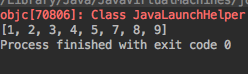

### 一、前言
归并排序是建立在归并操作上的一种有效的排序算法，该算法是采用**分治法（Divide and Conquer）**的一个非常典型的应用。
<!--more-->

### 二、算法思想
该算法采用经典的**分治**（divide-and-conquer）策略（分治法将问题**分**(divide)成一些小的问题然后递归求解，而**治**(conquer)的阶段则将分的阶段得到的各答案"修补"在一起，即分而治之)。

分而治之：

1、分阶段

可以看到这种结构很像一棵完全二叉树，本文的归并排序我们采用递归去实现（也可采用迭代的方式去实现）。分阶段可以理解为就是递归拆分子序列的过程，递归深度为logn。

2、治阶段

再来看看治阶段，我们需要将两个已经有序的子序列合并成一个有序序列，比如上图中的最后一次合并，要将[4,5,7,8]和[1,2,3,6]两个已经有序的子序列，合并为最终序列[1,2,3,4,5,6,7,8]，来看下实现步骤。


3.代码

```java
package com.tongcaipay.merchant.apply.study;

import java.util.Arrays;

public class MergingSort {

    /**
     * 定义一个要排序的数组 arr[m...n]
     *
     * @param m 数组arr[]的左下标
     * @param n 数组arr[]的右下标
     */
    public static void mergeSort(int[] arr, int m, int n) {
        if (m == n) {
            //当m=n时，数组内只有一个元素

        } else {
            //1.将数组一分为二
            int center = (m + n) / 2;  //将arr1[m...n]分成arr1[m...center]和arr1[center+1...n]

            //2.将数组arr1[m...center]排序
            mergeSort(arr, m, center);

            //3.将数组arr1[center+1...n]排序
            mergeSort(arr, center + 1, n);

            //4.合并两个数组
            merge(arr, m, center, n);
        }
    }

    /**
     * 将arr1[m...center]和arr1[center+1...n]归并为一个有序数组
     */

    public static void merge(int[] arr, int m, int center, int n) {
        int[] temp = new int[n - m + 1];
        int i = m;  //左指针
        int j = center + 1;  //右指针
        int k = 0;
        int l;
        //先把较小的数移入数组
        while (i <= center && j <= n) {
            if (arr[i] < arr[j]) {
                temp[k] = arr[i];
                k = k + 1;
                i = i + 1;
            } else{
                temp[k] = arr[j];
                k = k + 1;
                j = j + 1;
            }
        }
        // 上面的循环退出后，把剩余的元素依次填入到temp中
        // 以下两个while只有一个会执行
      
        //把左边剩余的数移入数组
        while (i <= center) {
            temp[k] = arr[i];
            k = k + 1;
            i = i + 1;

        }

        //把右边剩余的数移入数组
        while (j <= n) {
            temp[k] = arr[j];
            k = k + 1;
            j = j + 1;

        }

        for (int k2 = 0; k2 < temp.length; k2++) {   //把temp[]里的数组复制到arr[]里
            arr[k2 + m] = temp[k2];
        }
    }


    public static void main(String[] args) {
        int arr[] = {5, 4, 7, 9, 3, 8, 2, 1};
        mergeSort(arr, 0, arr.length - 1);
        System.out.print(Arrays.toString(arr));
    }
}


```
运行结果：



算法分析(以我的代码为例)：

* 分阶段：


* 治阶段


### 三、复杂度

* 时间复杂度：O(nlogn)

* 空间复杂度：O(N)

归并排序需要一个与原数组相同长度的数组做辅助来排序    
稳定性：归并排序是稳定的排序算法;这行代码可以保证当左右两部分的值相等的时候，先复制左边的值，这样可以保证值相等的时候两个元素的相对位置不变。

推荐：[排序算法总结](https://www.runoob.com/w3cnote/sort-algorithm-summary.html)