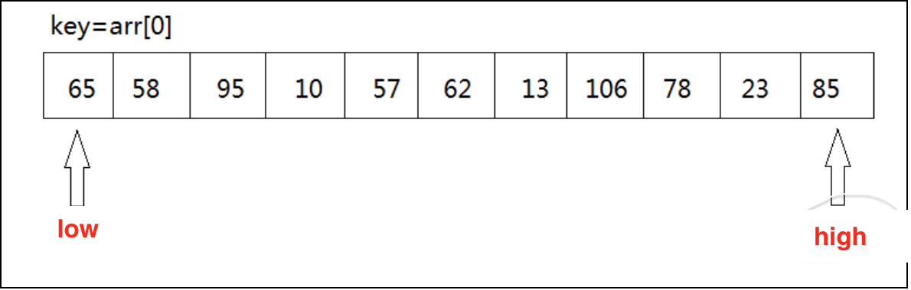
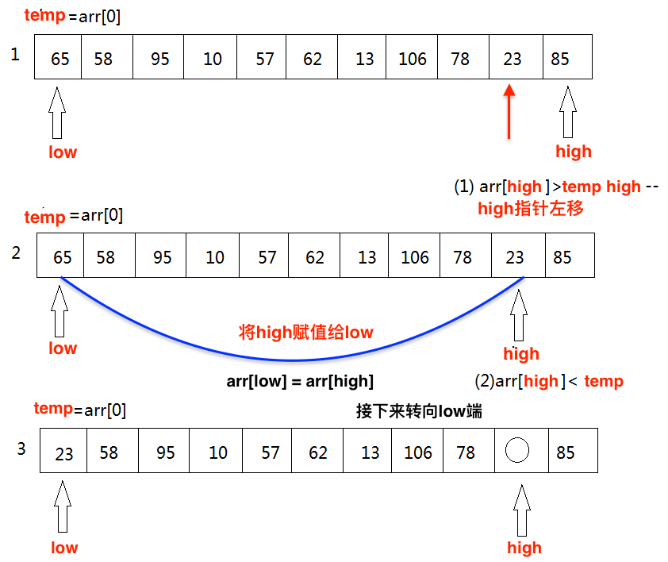
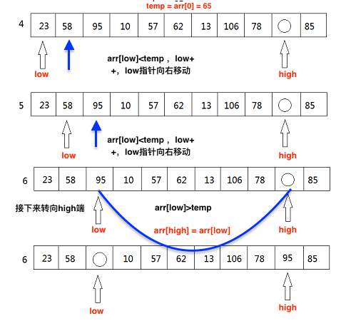
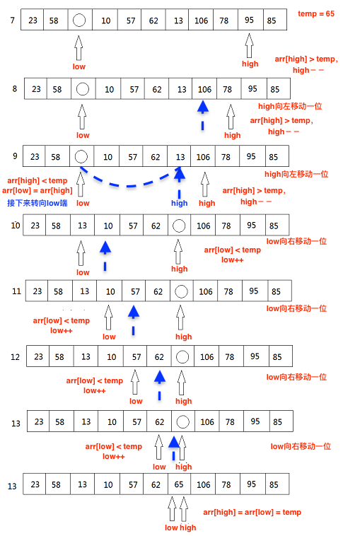
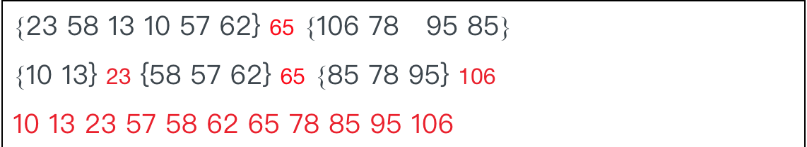
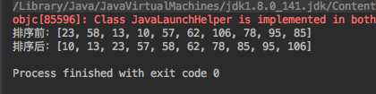

快速排序算法是冒泡排序的一种改进，快速排序也是通过逐渐消除待排序的无序序列中逆序元素来实现排序的。
<!--more-->

## 1.算法思想                                                                                                                                                                                                                                      
(1)  我们从待排序的记录序列中选取一个记录(通常第一个)作为基准元素(称为temp) temp = arr[low]，然后设置两个变量，low指向数列的最左部，high指向数据的最右部。


(2)  temp首先与 arr[high] 进行比较，如果 arr[high] < temp，则arr[low] = arr[high] 将 high 的值赋值给low;如果arr[high] > temp则我们只需要将 high--(high向左移动)。high-- 之后，再拿arr[hirh]与temp进行比较，直到arr[high] < temp交换元素为止。


(3)  如果右边存在arr[high] < temp的情况，将arr[low] = arr[high]，接下来，将转向low端，拿arr[low]与temp进行比较，如果arr[low] > temp,则将arr[high] = arr[low]，如果arr[low] < temp，则只需要将 low++,然后再进行arr[low] 与 temp的比较。


(4)  然后再移动high重复上述步骤


(5)  最后得到 {23 58 13 10 57 62} 65 {106 78 95 85}，再对左子数列与右子数列进行同样的操作。最终得到一个有序的数列。


## 2.算法实现
```java
package com.tongcaipay.merchant.apply.study;

import java.util.Arrays;

public class quickSort {
    /**
     * 定义一个要排序的数组 arr[low...high]
     * @param low  数组arr[]的左下标
     * @param high 数组arr[]的右下标
     */

    /*对数组arr[low...high]进行排序*/
    private static void quickSort(int[] arr, int low, int high) {
        if (low < high) {
            //对数组进行分割，取出下次分割的基准标号
            int index = getIndex(arr, low, high);  //算出枢轴值index


            quickSort(arr, low, index - 1);   //对index左侧对数组进行递归切割
            quickSort(arr, index + 1, high);    //对index右侧对数组进行递归切割

        }
    }

    private static int getIndex(int[] arr, int low, int high) {
        int temp = arr[low];  //用数组的第一个作为基准数据
        while (low < high) {
            //当队尾元素大于等于temp时，下标high向前移动
            while (low < high && arr[high] >= temp) {
                high--;
            }
            //当队尾元素小于temp时，将其赋值给low;

            //当队首元素小于等于temp时，下标low向后移动
            while (low < high && arr[low] <= temp) {
                low++;
            }
            //当队首元素大于temp时，将其赋值给high
            arr[high] = arr[low];
        }

        arr[high] = arr[low] = temp;  //此时high = low
        return high; // 返回tmp的正确位置
        //return low;

    }

    public static void main(String[] args) {
        int arr[] = {23, 58, 13, 10, 57, 62, 106, 78,95,85};
        System.out.println("排序前："+Arrays.toString(arr)+" ");
        quickSort(arr, 0, arr.length - 1);
        System.out.println("排序后："+Arrays.toString(arr)+" ");
    }
}

```
运行结果：


