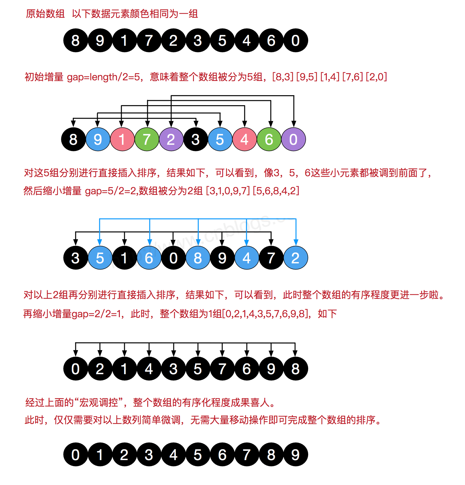
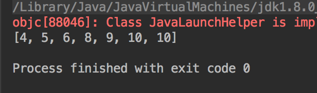

### 1.基本思想
希尔排序的基本思想就是：将需要排序的序列划分为若干个较小的序列，对这些序列进行直接插入排序，通过这样的操作可使需要排序的数列基本有序，最后再使用一次直接插入排序。
<!--more-->

在希尔排序中首先要解决的是怎样划分序列，对于子序列的构成不是简单地分段，而是采取将相隔某个增量的数据组成一个序列。一般选择增量的规则是：取上一个增量的一半作为此次子序列划分的增量，一般初始值元素的总数量。

* 算法步骤


* 代码实现

```java
package com.tongcaipay.merchant.apply.study;
import java.util.Arrays;

//希尔排序算法
public class ShellSort {
    public static void sort(int[] arr) {
        // 缩小增量gap的范围
        for (int gap = arr.length / 2; gap > 0; gap = gap / 2) {
            for (int i = gap; i < arr.length; i++) {
                int j = i;
                int temp = arr[j];
                while (j - gap >= 0 && temp < arr[j - gap]) {
                        arr[j] = arr[j - gap];
                        j = j - gap;
                    }
                    arr[j] = temp;
                }
            }
        }


    public static void main(String[] args) {
        int []arr = {10,10,4,8,9,6,5};
        sort(arr);
        System.out.println(Arrays.toString(arr));
    }


}

```

### 2.代码实现   



　 