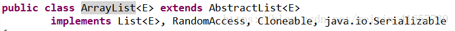
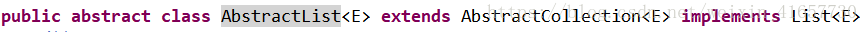
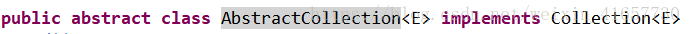
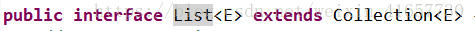
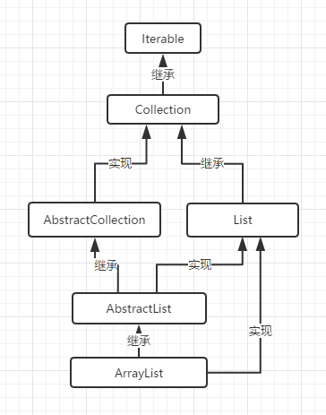

### 一、ArrayList的继承体系及性质
1.ArrayList的继承体系   
<font color= blue >ArrayList</font><font color= red >类</font>继承<font color= blue >AbstractList</font>类，实现<font color= blue >List</font>等多个接口：

<!--more-->

<font color= blue >AbstractList</font><font color= red >类</font>又继承<font color= blue >AbstractCollection</font>类，实现<font color= blue >List</font>接口：


<font color= blue >AbstractCollection</font><font color= red >类</font>实现<font color= blue >Collection</font>接口：


<font color= blue >Collection</font>接口继承<font color= blue >Iterable</font>接口：


<font color= blue >List</font>接口继承<font color= blue >Collection</font>接口：


所以ArrayList总体继承体系为：


### 二、ArrayList的方法使用和源码解析
1.构造方法：

```java
 private Object[] array;  //定义一个泛型的数组array

 private int size;   //当前数组长度


 public ArrayList() {
        array = new Object[10];  //默认情况下使用ArrayList会生成一个大小为10的Object类型的数组
 }

 public ArrayList(int capacity) {
        array = new Object[capacity];      //新建一个用户初始值大小的object数组。
 }
 
```
默认情况下使用ArrayList会生成一个大小为10的Object类型的数组。

实例：

```java
public static void main(String[] args) {
        List<String> list1 = new ArrayList<>();
        list1.add("1");
        list1.add("2");
        list1.add("3");
        list1.add("4");
        //list1.add(3,"1");
        list1.remove("2");
        //list1.set(2,"1");
        //System.out.println(list1.size());
        //System.out.println(list1.get(4));
        //System.out.println(list1.remove(3));
        //System.out.println(list1.isEmpty());
        //System.out.println(list1.size());
        list1.forEach(item -> {
            System.out.println(item);
        });

    }
```

2.**add(T e)**方法    
功能：在末尾添加一个元素。

```java
@Override
public void add(T e) {
	array[size++] = e;
}

```
在数组的末尾元素时，当前的数组长度加一。

3.**add(int index, T e)**方法   
功能：在指定下标 index 位置中设置一个元素，返回旧值

说明：加入元素e之前先要检查数组到大小首先检查index的值是否在0到size之间，可以为size.然后将index以及后面的元素向后面移动一位，将e放在index位置，size++。如果下标index不在0到size之间，则说明数组越界。

```java
@Override
public void add(int index, T e) {
	if (index > 0 && index <= size) {
		for (int i = size - 1; i >= size; i--) {
			array[i + 1] = array[i];
    	}
    	array[index] = e;
    	size++;
    }else{
    		throw new RuntimeException("数组越界");
    }
}
    
```

4.**set(int index, T e)**方法
功能：在指定下标 index 位置中设置一个元素，返回旧值

```java
@Override
public T set(int index, T e) {
	if (index > size || index<0 ) {
		throw new RuntimeException("数组越界");
    }else if(index == size){
    	array[index] = e;
       size++;
    } else {
       array[index] = e;
    }
       return null;  
｝

```

将e放到ArrayList下标为index的位置，此时就要分情况来讨论： 
  
* 当 index < 0 或者 index > size，说明数组越界了
* 当 index = size 时，相当于数组在末尾添加了一个新的元素，此时直接把元素e放在下标等于index的位置，当前size＋＋。
* 当 0<=index<size 时，说明在当前数组内，则直接把直接把元素e放在下标等于index的位置／

5.**get(int index)**方法   	
功能：返回指定下标为index的元素

```java
@Override
public  T get(int index) {
	if(index < size && index>=0) {
		return (T) array[index];
    }else {
       throw new RuntimeException("数组越界");
}

```

说明：获取指定元素的时候，当 0<=index<size 时，此时在数组内，返回指定下标元素，其余情况数组越界会抛异常。

6.**remove(int index)**方法   
功能：根据指定下标 index 删除指定元素，并返回删除的值

```java
@Override
public T remove(int index) {
	if(index>=0 && index<size) {
		Object m = array[index];   //获取删除元素的值
		for (int i = index+1 ;i<=size-1;i++){
			array[i-1] = array[i];    //将index后面所有的元素往前移一位。
	    }
	    size--;
    	return (T) m;
   }else {
       throw new RuntimeException("数组越界");
   }
}

```

说明: 删除指定下标为index的元素的值前，首先要确定其范围，当 0<=index<size 时，此时在数组内，可以进行删除操作。首先获取要删除的元素的值将其定义成一个泛型 m,随后将下标为index后面的元素往前移动一位，比如将array[index＋1]移动到array[index]上，以此类推，然后数组当前大小还要－1，最后返回删除的m的值。如果不在0<=index<size视为数组越界。

7.**boolean remove(Object o)**方法   
功能： 删除指定的值为e，并返回是否删除成功

```java
@Override
//删除元素
//只会删除第一个出现的元素。
public boolean remove(Object o) {
	if (o == null){
	// for循环遍历元素。找出待删除元素的index
 		for (int index = 0;index < size;index++){
       	if (array[index] == null) {
          	 remove(index);
          	 //此处导致只会删除第一个找到的相等元素
              return true;
          }
   }else{
   		 // for循环遍历元素。找出待删除元素的index
       for (int index = 0; index < size; index++) {
         	if (e.equals(array[index])) {
              remove(index);
              //此处导致只会删除第一个找到的相等元素
              return true;
          }
       }
   }
   return false;
}
```


8.**int size()**方法    
功能： 获取列表大小
 
```java
public int size() {
        return size;
    }
```

9.**boolean isEmpty()**方法   
功能： 判断是否为空

```java
@Override
public boolean isEmpty() {
	if(size == 0){
			return true;
        }else{
            return false;
        }
    }
}

```

10.**forEach(Consumer<T> action)**方法  
功能：遍历整改数组

```java
@Override
public void forEach(Consumer<T> action) {
	for(int i = 0;i<size;i++){
    	action.accept((T) array[i]);
    }
}

```

### 三、总结
Arraylist实现是基于动态数组点数据结构，动态大小是可变的，随机访问和遍历元素时，提供更好的性能。读的速度很无奈快，删除很麻烦。

推荐:

1.[ArrayList-你可能需要知道这些](https://www.jianshu.com/p/65c420f1a2e7)

2.[Java入门系列：实例讲解ArrayList用法](https://www.cnblogs.com/kungfupanda/p/7357142.html)


