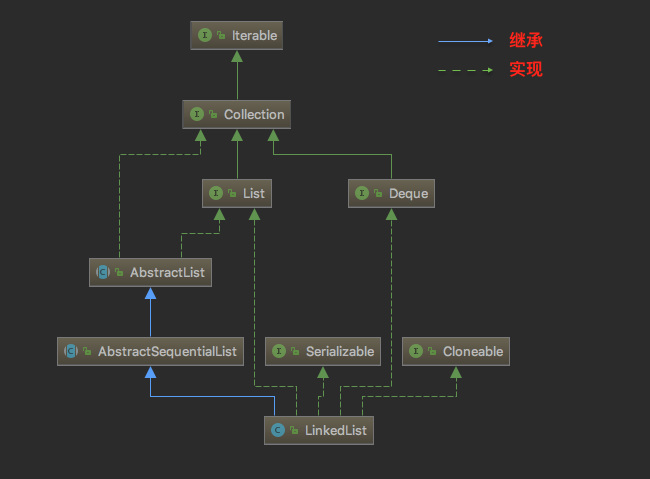
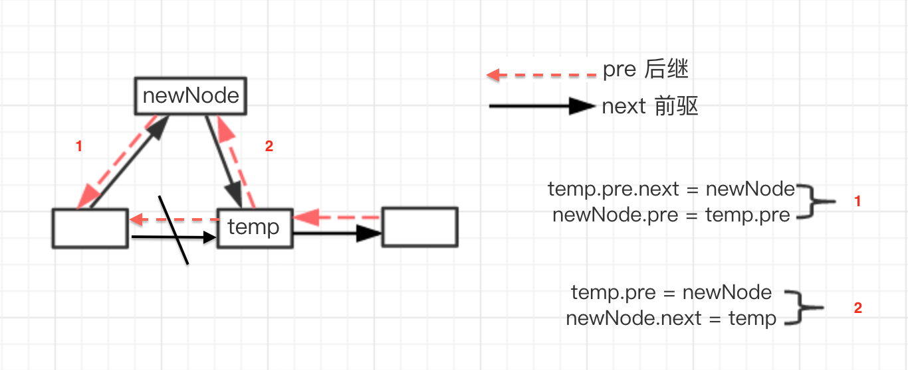
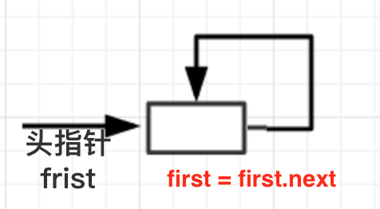
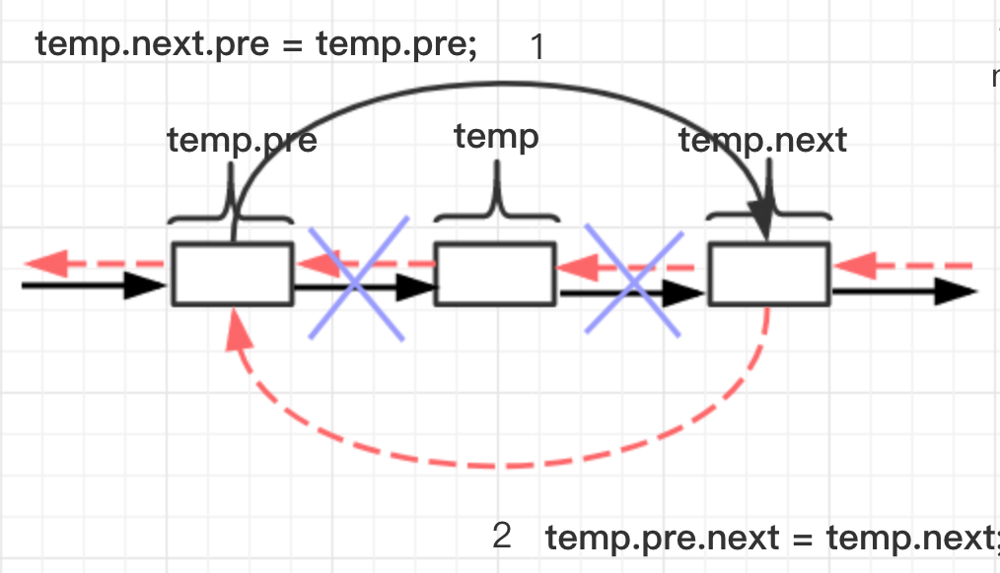

1.LinkedList类定义

```java
public class LinkedList<E>
     extends AbstractSequentialList<E>
     implements List<E>, Deque<E>, Cloneable, java.io.Serializable
```
<!--more-->
* LinkedList 是一个继承于 <font color= blue >AbstractSequentialList</font> 的双向链表。它也可以被当作堆栈、队列或双端队列进行操作。
* LinkedList 实现 <font color= blue >List</font> 接口，能对它进行队列操作。
* LinkedList 实现 <font color= blue >Deque</font>接口，即能将LinkedList当作双端队列使用。
* LinkedList 实现了 <font color= blue >Cloneable</font> 接口，即覆盖了函数clone()，能克隆。
* LinkedList 实现 <font color= blue >java.io.Serializable</font> 接口，这意味着LinkedList支持序列化，能通过序列化去传输。
* LinkedList 是非同步的。

LinkedList的类图关系：



2.LinkedList数据结构   
LinkedList的成员变量很少且只有三个：代表节点个数的 <font color= red >size</font>，前驱<font color= red >pre</font>和后继<font color= red >last</font>。Java中的LinkedList的数据结构是一个双向非循环链表，由内部类Node定义：

```java
private class Node<T> {
	T data;
	Node<T> next;//后继
	Node<T> pre;//前驱
   Node(T t) {
       this.data = t;
   }
｝
```


3.构造器   
定义一个<font color= red >first</font>,<font color= red >last</font>,以及链表当长度，但是头部和尾部要设置为空。

```java
Node<T> frist;  //头部
Node<T> last;   //尾部
int size;//链表长度
//底层数组
public LinkedList() {
	frist = last = null;
}

```

4.LinkedList核心操作:

* <font color= red >add(T e)</font>
* <font color= red >add(int index, T e)</font>
* <font color= red >set(int index, T e)</font>
* <font color= red >get(int index)</font>
* <font color= red >remove(int index)</font>
* <font color= red >remove(T e)</font>
* <font color= red >int size()</font>
* <font color= red >boolean isEmpty()</font>
* <font color= red >forEach(Consumer<T> action)</font>

1) **add(T e)**   
在末尾添加一个元素

```java
@Override
public void add(T e) {
	Node<T> n = new Node<T>(e);
   if (last == null) {
   		frist = n;
       last = n;
   } else {
       last.next = n;//最后一个元素下一个为此次添加的元素
       n.pre = last;//添加元素的前驱指前一个元素
       last = n;//此时最后一个元素为刚添加进入的
        }
        size++;
    }

```

说明：当在末尾添加元素的时候，先要判断尾部元素是否为空，若为空则说明只有一个元素，则直接把该元素放在里面；若尾部元素不为空的，则最后一个元素下一个为此次添加的元素，添加的元素的前驱指向前一个元素，那么此时最后一个元素为刚刚添加进入的。
2) **add(int index, T e)**   
 在指定下标 index 位置中添加一个元素
 
```java 
private Node<T> getNode(int index) {
 	if (index >= size || index < 0) {
 		throw new RuntimeException("数组越界");
 	}
   Node temp = frist;
   for (int i = 0; i < index; i++) {
   			temp = temp.next;
    }
    return temp;
}
@Override
public void add(int index, T e) {
	Node<T> newNode = new Node<T>(e);
	// 数组越界
   if (index < 0 || index > size) {
       throw new RuntimeException("数组越界");
   }
   // 末尾元素
   if (index == size) {
	   last.next = newNode;
	   newNode.pre = last;
	   last = newNode;
	   size++;
	   return;
   }
   // 中间元素
   Node temp = getNode(index);
   temp.pre.next = newNode;
   newNode.pre = temp.pre;
   temp.pre = newNode;
   newNode.next = temp;
   size++;
}

```

说明：此时需要进行分段考虑。

* 当 index < 0 或者 index > size 时，则为数组越界
* 当 index = size 时，此时相当于在末尾添加一个元素，在链表当范围之内，所以直接添加进去。
* 最后一种情况就是当在中间元素的时候，此时就比较麻烦，需要改变next和pre的方向。


3) **set(int index, T e)**    
在指定下标 index 位置中设置一个元素，返回旧值

```java 
private Node<T> getNode(int index) {
 	if (index >= size || index < 0) {
 		throw new RuntimeException("数组越界");
 	}
   Node temp = frist;
   for (int i = 0; i < index; i++) {
   			temp = temp.next;
    }
    return temp;
}

@Override
public T set(int index, T e) {
	//数组越界
	if (index > size || index < 0) {
		throw new RuntimeException("数组越界");
   } else if (index == size) {
		Node<T> newNode = new Node<>(e);
		last.next = newNode;
		newNode.pre = last;
		last = newNode;
		size++;
		return null;
	} else { //中间元素
		Node<T> node = getNode(index);
		T oldData = node.data;
		node.data = e;
		return oldData;
		}
}

```

说明：此时还是需要进行分段讨论

* 当 index < 0 或者 index > size 时，则为数组越界
* 当 index = size 时，此时相当于在末尾设置元素，在链表当范围之内，所以直接添加进去。
* 当在中间设置时，首先设置下标为index的元素oldData为node.data,再将元素e赋值为node.data,  最后返回oldData的值。

4) **get(int index)**   
根据指定下标获取元素

```java
@Override
public T get(int index) {
	if (index < size && index >= 0) {
		return getNode(index).data;
    } else {
    	throw new RuntimeException("数组越界");
	}
}

```

说明：当 0<=index<size时，返回指定下标下的值；其余情况下为数组越界。

5) **remove(int index)**  
根据指定下标 index 删除指定元素，并返回删除的值

```java
@Override
public T remove(int index) {
	if (index < 0 || index >= size) {
            throw new RuntimeException("数组越界");
   }

   if(index == 0){
   		Node<T> node = frist;
    	frist = frist.next;
    	size--;
       return node.data;
   }else{
       Node<T> temp = getNode(index);
       temp.next.pre = temp.pre;
       //再将temp的前驱的后继指向temp的后继
       temp.pre.next = temp.next;
       size--;
       return temp.data;
  }
}
```

说明：此时需要进行分组讨论：

* 当index < 0 或者 index >= size时，此时为数组越界
* 当 index = 0时，此时只有一个空链表。如图所示，然后



* 中间元素的删除：


5) **boolean remove(T e)**   
删除指定的值，并返回是否删除成功

```java
@Override
public boolean remove(T e) {
	for (int i = 0; i < size; i++) {
		if (get(i).equals(e)) {
			remove(i);
          break;
       }
    }
    return true;
}

```


6) **int size()**  
获取列表大小 

```java
@Override
public int size() {
	return size;
}

```

7) **boolean isEmpty()**   
判断是否为空

```java
@Override
public boolean isEmpty() {
	if (size == 0) {
		return true;
    } else {
       return false;
	}
}

```

8) **forEach(Consumer<T> action)**   
遍历所有元素

```java
@Override
public void forEach(Consumer<T> action) {
		Node<T>currentNode = frist;
		while (currentNode != null) {
			action.accept(currentNode.data);
			currentNode = currentNode.next;
       }
}

```

5.总结   
 LinkedList使用了循环双向链表数据结构进行实现，通过改动指针的方向来添加或删除某个元素，但是读的速度很慢，删除很方便。
 

6.源代码

```java
package com.tongcaipay.merchant.apply.study;


import java.util.function.Consumer;


public class LinkedList<T> implements List<T> {

    private class Node<T> {
        T data;
        Node<T> next;//后继
        Node<T> pre;//前驱

        Node(T t) {
            this.data = t;
        }
    }

    Node<T> frist;  //头部
    Node<T> last;   //尾部
    int size;//链表长度
    //底层数组

    public LinkedList() {
        frist = last = null;
    }


    @Override
    public void add(T e) {
        Node<T> n = new Node<T>(e);
        if (last == null) {
            frist = n;
            last = n;
        } else {
            last.next = n;//最后一个元素下一个为此次添加的元素
            n.pre = last;//添加元素的前驱指前一个元素
            last = n;//此时最后一个元素为刚添加进入的
        }
        size++;
    }

    private Node<T> getNode(int index) {

        if (index >= size || index < 0) {
            throw new RuntimeException("数组越界");
        }
        Node temp = frist;
        for (int i = 0; i < index; i++) {
            temp = temp.next;
        }

        return temp;
    }

    @Override
    public void add(int index, T e) {
        Node<T> newNode = new Node<T>(e);
        // 数组越界
        if (index < 0 || index > size) {
            throw new RuntimeException("数组越界");
        }

        // 末尾元素
        if (index == size) {
            last.next = newNode;
            newNode.pre = last;
            last = newNode;
            size++;
            return;
        }

        // 中间元素
        Node temp = getNode(index);
        temp.pre.next = newNode;
        newNode.pre = temp.pre;
        temp.pre = newNode;
        newNode.next = temp;
        size++;
    }


    @Override
    public T set(int index, T e) {
        //数组越界
        if (index > size || index < 0) {
            throw new RuntimeException("数组越界");
        } else if (index == size) {
            Node<T> newNode = new Node<T>(e);
            last.next = newNode;
            newNode.pre = last;
            last = newNode;
            size++;
            return null;
        } else { //中间元素
            Node<T> node = getNode(index);
            T oldData = node.data;
            node.data = e;
            return oldData;
        }

    }

    @Override
    public T get(int index) {
        if (index < size && index >= 0) {
            return getNode(index).data;
        } else {
            throw new RuntimeException("数组越界");
        }
    }

    @Override
    public T remove(int index) {
        if (index < 0 || index >= size) {
            throw new RuntimeException("数组越界");
        }

        if(index == 0){
            Node<T> node = frist;
            frist = frist.next;
            size--;
            return node.data;
        }else{
            Node<T> temp = getNode(index);
            temp.next.pre = temp.pre;
            //再将temp的前驱的后继指向temp的后继
            temp.pre.next = temp.next;
            size--;
            return temp.data;
        }
    }

    @Override
    public boolean remove(T e) {
        for (int i = 0; i < size; i++) {
            if (get(i).equals(e)) {
                remove(i);
                break;
            }
        }
        return true;
    }

    @Override
    public int size() {
        return size;
    }

    @Override
    public boolean isEmpty() {
        if (size == 0) {
            return true;
        } else {
            return false;
        }
    }

    @Override
    public void forEach(Consumer<T> action) {
        Node<T>currentNode = frist;
        while (currentNode != null) {
            action.accept(currentNode.data);
            currentNode = currentNode.next;
        }

    }

    public static void main(String[] args) {
        List<String> list = new LinkedList<>();
        list.add("1");
        list.add("2");
        list.add("3");
        list.add("4");
        //list.add(3,"1");
        list.remove(7);
        //list.set(5,"1");
        //System.out.println(list.size());
        //System.out.println(list.get(4));
        //System.out.println(list.remove(3));
        //System.out.println(list.isEmpty());
        //System.out.println(list.size());
        list.forEach(item -> {
            System.out.println(item);
        });
    }


}


```


