>补充基础知识～
>
>数据结构这门课程在以前学习过，但是由于当时学得比较一般就感觉并没有学到什么，于是在朋友的推荐下看《大话数据结构》，对于我这种小白来说是很友好的。整本书都感觉很通俗易懂，不像以前那样几乎看不懂。
>
>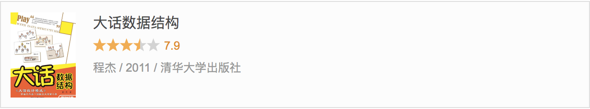
<!--more-->

## 第一章 数据结构绪论

程序 = 数据结构 + 算法   
#### 1.1 数据（data)   
是描述客观事物的符号，是计算机中可操作的对象，是能被计算机识别，并输入给计算机处理的符号集合。

#### 1.2 数据元素（data element）
是组成数据的，有一定意义的基本单位，在计算机中通常作为整理处理，也被成为记录。

#### 1.3 数据项（data item）
数据项：一个数据可以由若干个数据项组成；   
数据项是数据不可分割的最小单位

#### 1.4 数据对象(data object)
数据对象：是性质相同的数据元素的集合，是数据的子集。

#### 1.5 数据结构
数据结构：是相互之间存在一种或多种特定关系的数据元素集合

总结一下它们之间的关系：
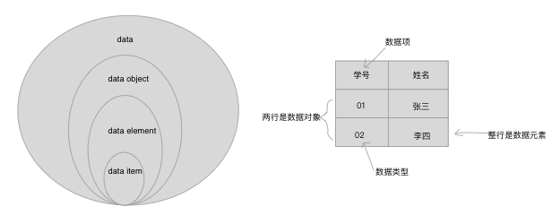

#### 1.6 逻辑结构与物理结构

#### 1.6.1 逻辑结构

 1.集合结构

集合结构：集合结构中的数据元素除了同属于一个集合外，没有其他关系。

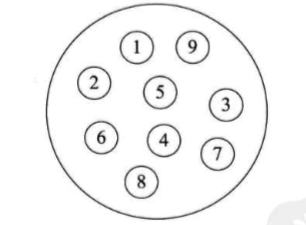

 2.线性结构

线性结构：线性结构中的数据元素是一对一的关系.

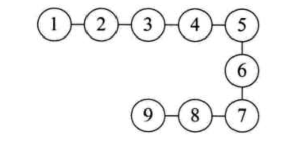

3.树形结构

树形结构：树形结构中的数据元素之间存在一种一对多的层次关系

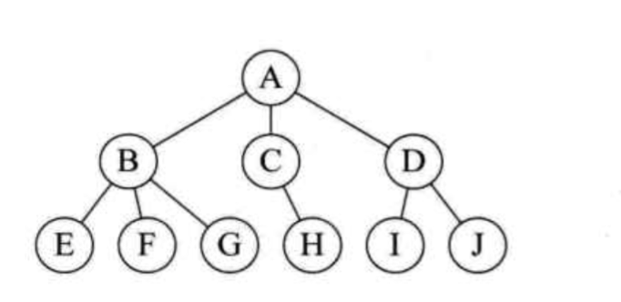


4.图形结构

图形结构: 图形结构的数据元素是多对多的关系

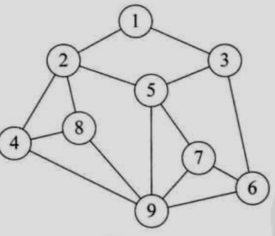

#### 1.6.2 物理结构
物理结构：是指数据的逻辑结构在计算机中的存储形式。

1.顺序存储结构

开辟一段连续的空间，依次按顺序存放数据元素

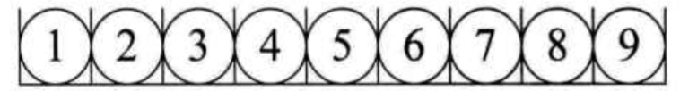

2.链式存储结构

现在如银行、医院等地方，设置了排队系统，也就是每个人去了，先领一个号，等着叫号，叫到时去办理业务或看病。在等待的时候，你爱在哪在哪，可以坐着、站着或者走动，甚至出去逛一圈，只要及时回来就行。你关注的是前一个号有没有被叫到，叫到了，下一个就轮到了。

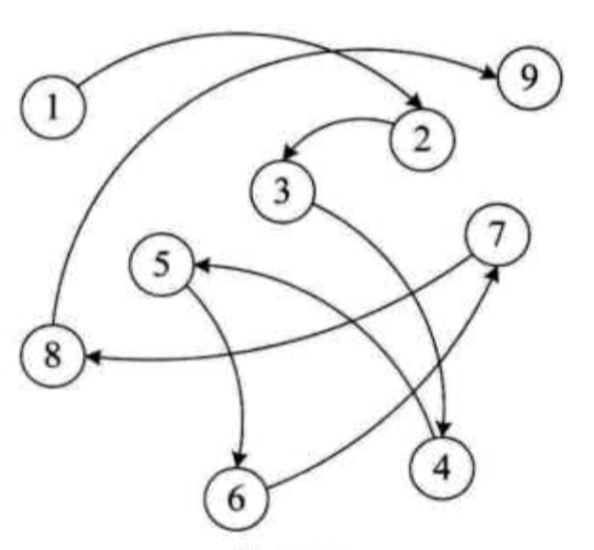

#### 1.7抽象数据类型

事实上，抽象数据类型体现了程序设计中问题分解、抽象和信息隐藏的特性。抽象数据类型把实际生活中的问题分解为多个规模小且容易处理的问题，然后建立一个计算机能处理的数据模型，并把每个功能模块的实现细节作为一个独立的单元，从而使具体实现过程隐藏起来。


## 第一章总结
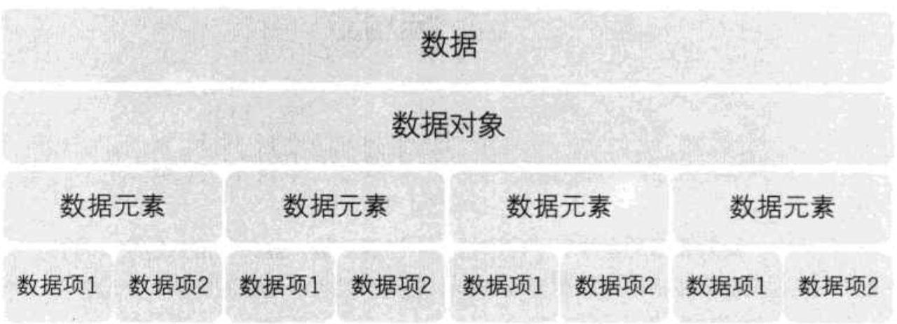

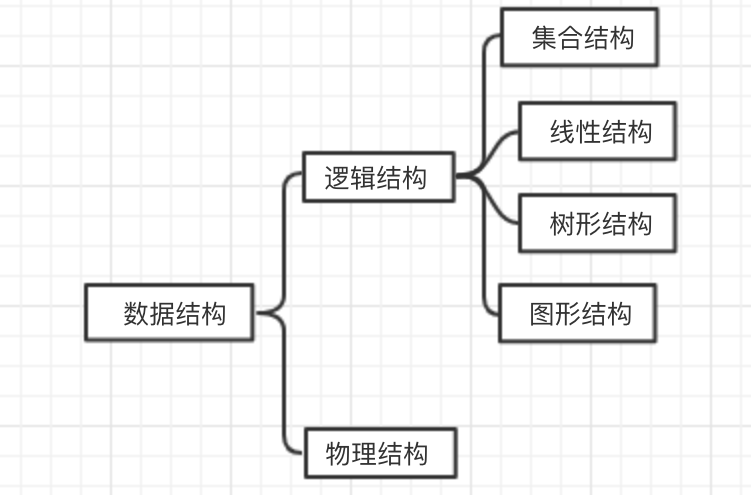

## 第二章 算法
算法：算法是解决特定问题求解步骤的描述，在计算机中表现为指令的有限序列，并且每条指令表示一个或多个操作。

为了解决某个或某类问题，需要把指令表示成一定的操作序列，操作序列包括一组操作，每一个操作都完成特定的功能，这就是算法了。

算法具有五个基本特性：输人、输出、有穷性、确定性和可行性。

#### 算法时间复杂度定义#
>在进行算法分析时，语句总的执行次数T（n）是关于问题规模n的函数，进而分析T（n）随n的变化情况并确定T（n）的数量级。算法的时间复杂度，也就是算法的时间量度，记作：T（n）=O(f(n))0它表示随问题规模n的增大，算法执行时间的增长率和f（n）的增长率相同，称作算法的渐近时间复杂度，简称为时间复杂度。其中f（n）是问题规模n的某个函数。

#### 常见的时间复杂度
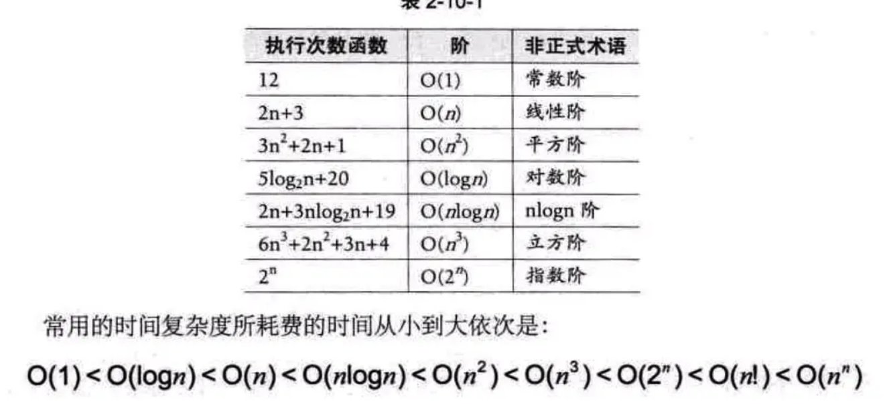
记住logN > 1；   2^n  < n! < n^n 就好理解了;


##第二章总结
算法的定义：算法是解决特定问题求解步骤的描述，在计算机中为指令的有限序列，并且每条指令表示一个或多个操作。

算法的特性：有穷性、确定性、可行性、输人、输出。

算法的设计的要求：正确性、可读性、健壮性、高效率和低存储量需求。

算法特性与算法设计容易混，需要对比记忆。

算法的度量方法：事后统计方法（不科学、不准确）、事前分析估算方法。在讲解如何用事前分析估算方法之前，我们先给出了函数渐近增长的定义。函数的渐近增长：给定两个函数f(n)和g(n)，如果存在一个整数N，使得对于所有的n>N，f〔n〕总是比g〔n)大，那么，我们说f〔n)的增长渐近快于g〔n)。于是我们可以得出一个结论，判断一个算法好不好，我们只通过少量的数据是不能做出准确判断的，如果我们可以对比算法的关键执行次数函数的渐近增长性，基本就可以分析出：

某个算法，随着n的变大，它会越来越优于另一算法，或者越来越差于另一算法。

## 第三章 线性表
## 一、简介   
### 1、线性表定义   
线性表的定义：<font color= red >零个或多个数据元素的有限序列</font>
这里有需要注意的几个关键地方： 

1.首先他是一个序列，也就是说元素之间是有个先来后到的。

2.若元素存在多个，则<font color= red >第一个元素无前驱</font>，而<font color= red >最后一个元素无后继</font>最后一个元素无后继，其他元素都有且只有一个前驱和后继。

3.线性表强调是有限的，事实上无论计算机发展到多钱大，他所处理的元素都是有限的。

使用数学语言来表达的话：  **a1,…,ai-1,ai,ai+1,…an**

表中ai-1领先于ai,ai领先于ai+1,称ai-1是ai的直接前驱元素,ai+1是ai的直接后继元素。所以线性表元素的各数n（n>0）定义为线性表的长度，当n=0时，称为空表。

### 2、抽象数据类型
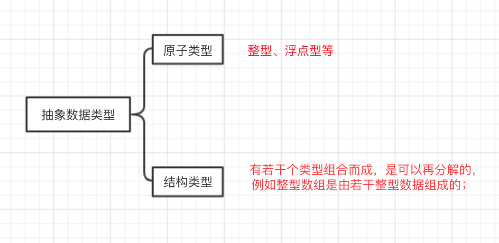

## 二、线性表实现及优缺点
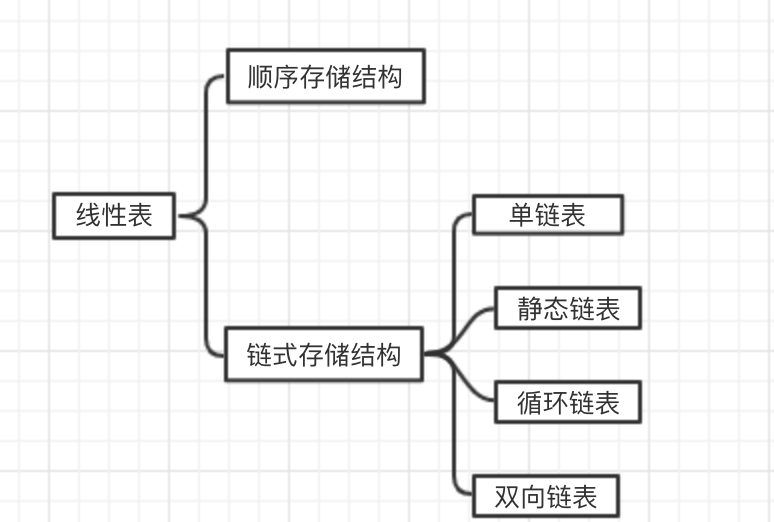
### 1、线性表的顺序存储结构
线性表的顺序存储结构，指的是用一段地址<font color= red >连续的存储单元</font>一次存储线性表的数据元素。

线性表（a1,a2,……,an）的顺序存储如下：
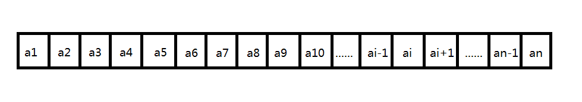

事实上物理上的存储方式事实上就是在内存中找个初始地址，然后通过占位的形式，把一定的内存空间给占了，然后把相同数据类型的数据元素依次放在这块空地中。

总结一下，顺序存储结构封装需要三个属性：

* 存储空间的起始位置，数组data，它的存储位置就是线性表存储空间的存储位置；
* 线性表的最大存储容量：数组的长度:MaxSize；
* 线性表的当前长度:length；

注意：<font color= red >数组的长度</font>与<font color= red >线性表的当前长度</font>需要区分一下。数组的长度是存放线性表的存储空间的总长度，一般初始化后不变。而线性表的当前长度是线性表中元素的个数，是会变化的。

<font color= red >在任意时刻，length <= MaxSize</font>

在线性表的顺序存储结构中，它具有随机存储结构的特点，即直接通过下标获取数据或存储，那储它的时间复杂度为O(1)。而当该结构的数据类型做插入操作时，就不能只插入而不管后面的元素，所以插入操作，也要考虑清楚。

**插入算法的思路：**   
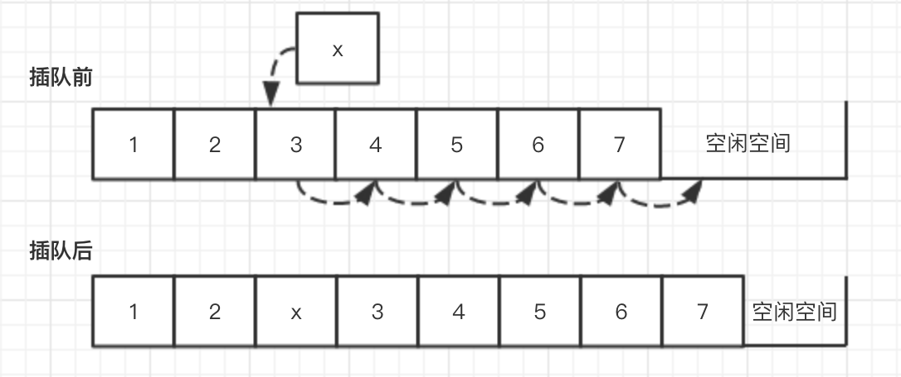

* 如果插入位置不合理，抛出异常；
* 如果线性表长度大于等于数组长度，则抛出异常活动太增加数组容量；
* 最后一个元素开始向前遍历到第i个位置，分别将它们都向后移动一个位置；
* 将要插入元素填入位置i处；
* 表长加1；

Java代码实现：

```java
/* 初始条件：顺序线性表L已存在，1 <= i <= length */
/* 操作结果：在L中第 index 个位置之前插入新的元素e,L的长度加1 */
public void add(int i, T e) 
	if (data.length == Maxsize)
		throw new RuntimeException("数组越界");
   if (i < 1 || i > data.length + 1)
   		throw new RuntimeException("数组越界");
   	if (i <= data.length){
   		for(int i = data.length - 1; i>= i - 1;k-s-)
   			data[k+1] =data[k];
	}
	data[i-1] = e;
	data.length++;
}
```

**删除算法的思路：**
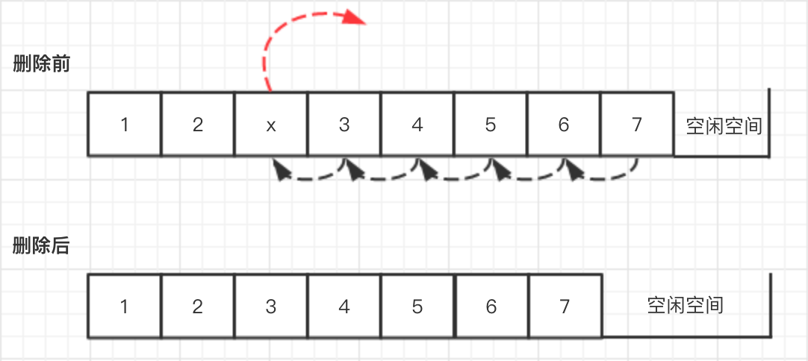

* 如果删除位置不合理，抛出异常；
* 取出删除元素；
* 从删除元素位置开始遍历到最后一个元素，分别将它们都向前移动一个位置；
* 表长减1

Java代码实现：

```java
/* 初始条件：顺序线性表L已存在，1 <= i <= length */
/* 操作结果：删除第i元素，并用e返回其值，L的长度减1 */
public void remove(int i,T e){
	int k;
	if(data.length == 0)
		throw new RuntimeException("数组越界");
	if(i < 1 || i > data.length
		throw new RuntimeException("数组越界");
	e = data[i - 1];
	if(i < data.length)
	{
		for(k = i;k < data.length;k++)
		data[k-1] = data[k];
	}
	data.lenrth--;
} 	

```

**插入和删除的时间复杂度**

最好情况：插入和删除操作刚好要求在最后一个位置操作，因为不需要移动任何元素，所以此时的时间复杂度为**O(1)**。

最坏情况：如果要插入和删除的位置是第一个元素，那就意味着要移动所有的元素向后或者向前，所以这个时间复杂度为**O(n)**。

平均情况，就取中间值**O((n-1)/2)**。

这样来看，平均情况复杂度简化后还是<font color= red >**O(n)**<= MaxSize</font>


**线性表顺序存储结构的优缺点：**

**优点**

* 无需为表中元素之间的逻辑关系而增加额外的存储空间；
* 可以快速地存取表中任意位置的元素；

**缺点**

* 插入和删除操作需要移动大量元素；
* 当线性表长度变化较大时，难以确定存储空间的容量；
* 容易造成存储空间的“碎片”；

### 2、线性表的链式存储结构
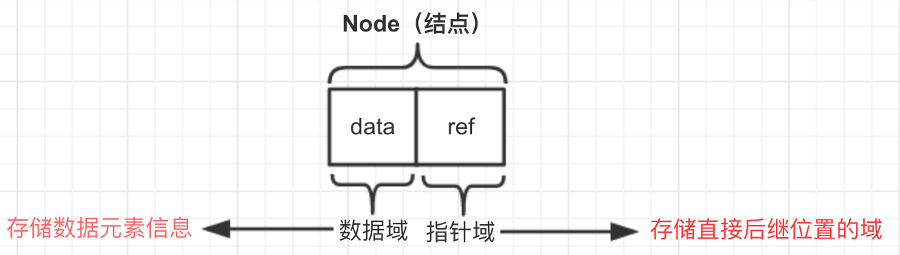

对于线性表来说，总得有个头有个尾，链表也不例外。我们把链表中的第一个结点的存储位置叫做头指针，最后一个结点指针为空(NULL)。

在顺序存储结构中，有随机存储结构的特点，计算任意一个元素的存储位置是很容易的，但是在单链表中，想知道其中一个元素的位置，就得从第一个结点开始遍历，因此，对于单链表实现获取第i个元素的数据的操作，在算法上较为复杂。

**用java语言描述链式存储结构**

```java                      
/**
 * 　定义一个节点结点Node
 */
private class Node<E> {
	E data;  //数据域
	Node<E> next;  //指针域
	
	public Node(E data, Node<E> next) {
	   this.data = data;
	   this.next = next;
    }
}
```

算法思路：
* 声明一个节点p指向链表第一个节点，初始化j从1开始；
* 当j<i时， 遍历链表，让p的指针向后移动，不断指向下一个节点，j++；
* 若到链表末尾p为空，则说明第i个元素不存在；
* 否则查找成功，返回节点p的数据；

**单链表数据的获取：**

```java
public Node index(int index){
     if(index==0){
         //头一个结点下标为0
         current=head;
         
         return current;
         //删除后链表为空
     }else{
         current=head;
         for(int i = 0;i < index - 1;i++){
             current=current.next;
             //因为current.next赋值给了current，所以要设置为index-1
         }
         
     }
     return current;
 }
```

**单链表的插入：**
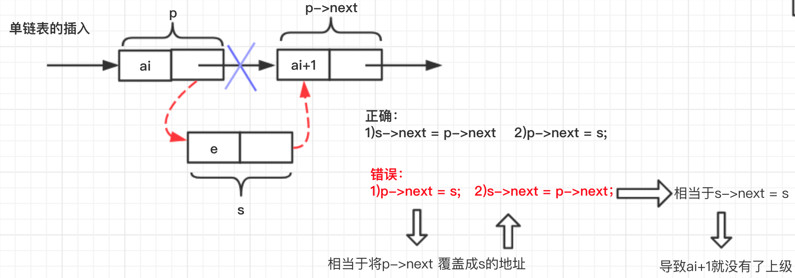
算法思路：

* 声明一个指针p指向链表的第一个结点，初始化j从1开始
* 当j<i时，就遍历链表，让p指针向后移动一位，不断地指向下一个结点，j++；
* 若到链表末尾p为空，则说明第i个结点不存在
* 否则查找成功，在系统中生成一个空节点s
* 将数据元素e赋值给s->data
* 单链表的插入标准语句，s->next = p->next,p->next=s;
* 返回成功

```java
/**
  * 获取第i个结点（包括第0个结点，头结点）
  * 获取结点值只需要GetNode(i).data即可，不再写方法了
  */
public Node<E> GetNode(int i) {
	if (i < 0 || i > count) {
		throw new RuntimeException("元素位置错误！");
    } else if (i == 0) {
   		 return head;    //第0个节点为head
    } else {   //1 <= i <= count
	    Node<E> node = head.next;
	    for (int k = 1; k < i; k++) {
	    	node = node.next;
	    }
	    return node;
    }
}


/**
  * 第i个位置插入新的元素
  */
public void ListInsert(int i, E e) {
	if (i < 1 || i > count + 1) {
		throw new RuntimeException("插入位置错误！");
	} else {
		Node<E> newNode = new Node<E>(e, null);
		newNode.next = GetNode(i - 1).next;  //因为GetNode()方法中包含了获取头结点，所以不需单独判断了
		GetNode(i - 1).next = newNode;
		count++;
		System.out.println("插入成功！");
   }
}

```

**单链表的删除：**
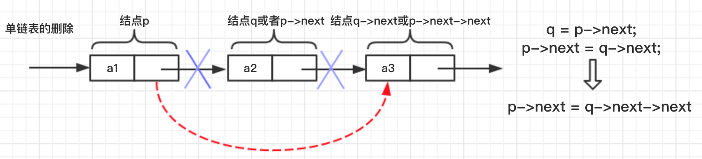
算法思路：

* 一个指针p指向链表的第一个结点，初始化j从1开始
* 当j<i时，就遍历链表，让p指针向后移动一位，不断地指向下一个结点，j++；
* 若到链表末尾p为空，则说明第i个结点不存在
* 否则，查找成功，将欲删除的结点p->next赋给q
* 单链表的删除标准语句p->next=q->next
* 将q结点中的数据赋给e，作为返回
* 释放q结点
* 返回成功

```java
/**
  * 获取第i个结点（包括第0个结点，头结点）
  * 获取结点值只需要GetNode(i).data即可，不再写方法了
  */
public Node<E> GetNode(int i) {
	if (i < 0 || i > count) {
		throw new RuntimeException("元素位置错误！");
    } else if (i == 0) {
   		 return head;    //第0个节点为head
    } else {   //1 <= i <= count
	    Node<E> node = head.next;
	    for (int k = 1; k < i; k++) {
	    	node = node.next;
	    }
	    return node;
    }
}


/**
* 删除第i个位置元素，并返回其值
*/
public E ListDelete(int i) {
	if (i < 1 || i > count)
		throw new RuntimeException("删除位置错误！");
	Node<E> node = GetNode(i);
   E e = node.data;
   GetNode(i - 1).next = node.next;
   node = null;
   count--;
   System.out.println("删除成功!");
   return e;
}

```

**单链表的查找元素，0代表失败：**
算法思路：

* 首先定义一个node节点，node结点为head结点的下一个结点，然后判断node结点的数据是否等于e,若等于e则表示成功，返回1；若不等于e,则从第一个元素开始从前到后便利每一个元素， node = node.next;然后判断node结点的数据是否等于e,若等于则返回k+1;

```java
/**
  * 查找元素，0代表查找失败
  */
public int LocateElem(E e) {
	Node<E> node;
	node = head.next;
	if (node.data == e)
		return 1;
   for (int k = 1; k < count; k++) { 
   		 node = node.next;
        if (node.data == e)
         		return k + 1;
   }
   System.out.println("查找失败！");
   return 0;
}

```

**实现程序**
```java
package com.tongcaipay.merchant.apply.study;
/**
 * 说明：
 * 1.《大话数据结构》中没有线性表的长度，但提到可以存储于头节点的数据域中。
 *   本程序的线性表长度存放于count变量中，线性表长度可以使程序比较方便。
 * 2.程序中，第i个位置代表第i个结点，头结点属于第0个结点
 * 3.因为链表为泛型，整表创建采用整型（随机整数做元素），所以有出现一些类型转换
 * 4.Java程序的方法一般以小写开头，但为和书上一致，程序中方法采用了大写开头。
 *
 * 注意点：
 * 1.count在增删元素时要加一或减一千万别忘了
 * 2.清空线性表要每个元素都null
 *
 * @ xiao lei
 *
 */
public class LinkList<E> {
    private Node<E> head;  //头结点
    private int count;  //线性表长度

    /**
     * 　定义一个节点结点Node
     */
    private class Node<E> {
        E data;  //数据域
        Node<E> next;  //指针域

        public Node(E data, Node<E> next) {
            this.data = data;
            this.next = next;
        }
    }

        /**
         * 线性表的初始化
         */
        public LinkList() {
            head = new Node<E>(null,null);  //不是head=null;
            count = 0;  //线性表第长度
        }

        /**
         * 判断线性表是否为空
         */
        public boolean IsEmpty() {
            if (count == 0) {
                System.out.println("表为空！");
                return true;
            } else {
                System.out.println("表不为空！");
                return false;
            }
            //return count==0;
        }


        /**
         * 清空线性表
         */
        public void ClearList() {
            Node<E> node;
            while (count != 0) {
                node = head.next;
                head.next = node.next;
                node = null;
                count--;
            }
            System.out.println("线性表已清空！");
        }

        /**
         * 获取第i个结点（包括第0个结点，头结点）
         * 获取结点值只需要GetNode(i).data即可，不再写方法了
         */
        public Node<E> GetNode(int i) {
            if (i < 0 || i > count) {
                throw new RuntimeException("元素位置错误！");
            } else if (i == 0) {
                return head;    //第0个节点为head
            } else {   //1 <= i <= count
                Node<E> node = head.next;
                for (int k = 1; k < i; k++) {
                    node = node.next;
                }
                return node;
            }
        }

        /**
         * 获取第i个结点的数据(包括头结点)
         */
        public E GetData(int i) {
            return GetNode(i).data;
        }

        /**
         * 查找元素，0代表查找失败
         */
        public int LocateElem(E e) {
            Node<E> node;
            node = head.next;
            if (node.data == e)
                return 1;
            for (int k = 1; k < count; k++) {
                node = node.next;
                if (node.data == e)
                    return k + 1;
            }
            System.out.println("查找失败！");
            return 0;
        }

        /**
         * 第i个位置插入新的元素
         */
        public void ListInsert(int i, E e) {
            if (i < 1 || i > count + 1) {
                throw new RuntimeException("插入位置错误！");
            } else {
                Node<E> newNode = new Node<E>(e, null);
                newNode.next = GetNode(i - 1).next;  //因为GetNode()方法中包含了获取头结点，所以不需单独判断了
                GetNode(i - 1).next = newNode;
                count++;
                System.out.println("插入成功！");
            }
        }

        /**
         * 删除第i个位置元素，并返回其值
         */
        public E ListDelete(int i) {
            if (i < 1 || i > count) {
                throw new RuntimeException("删除位置错误！");
            }else {
                Node<E> node = GetNode(i);
                E e = node.data;
                GetNode(i - 1).next = node.next;
                node = null;
                count--;
                System.out.println("删除成功!");
                return e;
            }
        }


        /**
         * 获取线性表长度
         */
        public int ListLength() {
            return count;
        }

```

测试代码：

　　基本数据类型和引用类型各写了一个测试代码。
　　
```java
 public static void main(String[] args) {
            LinkList<Integer> nums = new LinkList<Integer>();
            System.out.println("——————————插入5个元素到表中,并读取内容——————————");
            for (int i = 1; i <= 5; i++)
                nums.ListInsert(i, 2 * i);
            nums.IsEmpty();
            int num;
            for (int i = 1; i <= 5; i++) {
                num = nums.GetData(i);
                System.out.println("第" + i + "个位置的值为：" + num);
            }
            System.out.println("——————————查找0、2、10是否在表中——————————");
            System.out.print("0的位置：");
            System.out.println(nums.LocateElem(0));
            System.out.print("2的位置：");
            System.out.println(nums.LocateElem(2));
            System.out.print("10的位置：");
            System.out.println(nums.LocateElem(10));
            System.out.println("——————————删除2、10——————————");
            num = nums.ListDelete(1);
            System.out.println("已删除：" + num);
            num = nums.ListDelete(4);
            System.out.println("已删除：" + num);
            System.out.println("当前表长：" + nums.ListLength());
            for (int i = 1; i <= nums.ListLength(); i++) {
                num = nums.GetData(i);
                System.out.println("第" + i + "个位置的值为：" + num);
            }
            nums.ClearList();
            nums.IsEmpty();
        }
```
**实验结果**：
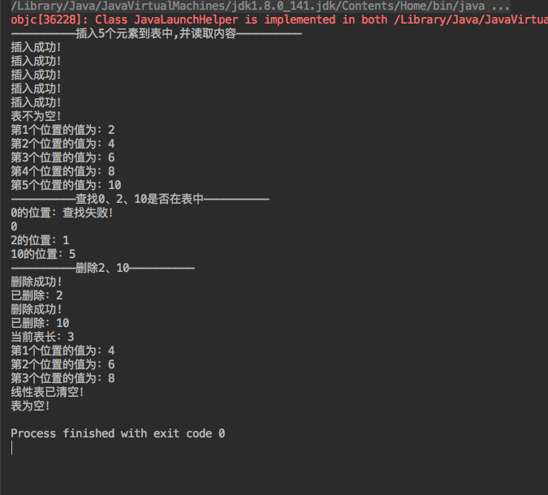

单链表与顺序存储结构的对比：
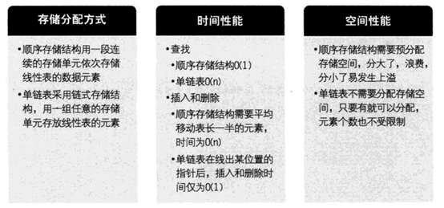

