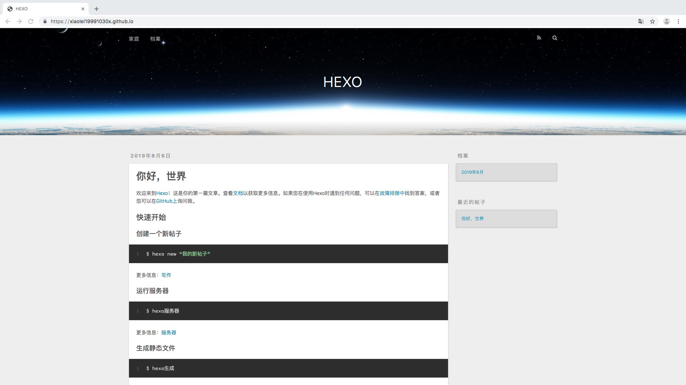

### 前言：
最近在学习数据结构的排序算法的时候想尝试写博客，于是在网上翻阅了许多写博客网站，比如CSDN、简书、github等等，相比较之后发现还是在github上搭建自己的博客挺有趣的，翻阅了无数的资料，这其中遇到了很多困难，但最终还是成功了，所以接下来给大家分享一下如何在mac笔记本上搭建自己的博客。
<!--more-->

***
### 过程：
博客的搭建大致分为以下几个步骤：

* 配置环境
* 安装Hexo
* 如何将hexo与github page联系起来
* 保留CNAME、README.md等文件
* 修改hexo的主题
* 写博客

###  一、配置环境
*  安装Node.js（必须）

	用来生成静态页面的，去官网直接下载最新版本，默认安装即可。
	
	
	
*  安装Git（必须）

	用来把本地的hexo内容提交到github上去，去官网直接下载最新版本，默认安装即可。
	
*  注册github帐号且配置环境（必须）

   github是一个利用Git进行版本控制、专门用于存放软件代码与内容的共享虚拟主机服务,很多人都把它称作程序员的同性交友网站,具体为啥这么叫我也不知道。（建议大家看英文的网站，不要看中文的）
	 
注册完以后在你的帐号下新建一个仓库（New repository)
	
	
		
以上步骤完成后可用在命令行检查自己是否安装成功,顺便介绍一下如何使用mac的命令行。

```  
    node -v         //查看安装的Node版本
	
    Git --version  //查看安装的Node版本      
```


以下是我的Node和Git版本：
 
 
                  
    

	
### 二、安装Hexo
Node和Git都安装好后,首先创建一个文件夹,如blog,用户存放hexo的配置文件,然后进入blog里安装Hexo。

```
	mkdir blog   //创建一个blog文件夹
         
	cd blog     //进入blog文件夹
         
	sudo npm install-g hexo   //安装hexo
```


在安装hexo这一步的时候总是不断报错，在这里花了好长的时间才安装好，具体的命令我也忘了。。。。

* 查看hexo版本

```
   hexo -v
```


  
* 执行init命令初始化hexo,命令:

```
   hexo init
```
hexo会自动下载一些文件到这个目录，包括node_modules，目录结构如下图：

  
 
* 生成静态页面

```
   hexo g
```
生成静态文件到public文件夹，没有public文件夹就会自动创建，如果有了就会覆盖public内容。public文件夹的内容是要提交到github上的。

  

* 启动本地服务，进行文章预览调试，命令：

```
   hexo server
```
浏览器输入 http://0.0.0.0:4000/ 就可以看到很丑的默认初始页了	
 
 
### 三、如何将hexo与github page联系起来 
分为三步：

* 配置SSH key

* 设置Git的user name和email

* 配置deployment


1、配置SSH key

mac 系统开始就已经为我们安装了ssh，如果没有安装，首先安装打开终端输入查看ssh版本：
       
```
	ssh -v
```

这个表明ssh已经安装

如果没有安装，在终端输入以下命令：

```
	ssh-keygen -t rsa -C "youremail@example.com"
```
	
然后连续3次回车，最终会生成一个文件在用户目录下


 然后打开用户目录，找到.ssh\id_rsa.pub文件，记事本打开并复制里面的内容，打开你的github主页，进入个人设置 -> SSH and GPG keys -> New SSH key：

这里我是用终端来操作的,命令如下：

```
	cd .ssh      //进入.ssh文件夹
	
	ls          //查看.ssh里面的文件
	
	cat id_rsa.pub   //查看id_rsa.pub里的内容
```
	


将复制的内容粘贴到key那里，title随便填，保存


测试一下是否成功

```
	ssh -T git@github.com  //注意邮箱地址不用改
```

看到这个信息说明SSH已配置成功！

2.设置Git的user name和email

```
	git config --global user.name "xiaolei19991030x"        // 你的github用户名，非昵称
	
	git config --global user.email  "1784640836@qq.com"     // 填写你的github注册邮箱
```
 3.设置deployment

配置blog/_config.yml中有关deploy的部分


正确写法：

```
deploy:
		type: git 
		repository：git@github.com:username/username.github.io.git  
		branch: master
		
```

注意：repository这种形式的是配置了SSH Key之后的，如果没有配置则使用Https形式的地址,冒号后面一定要空一格不然会报错的！！！

```
	repository: https://github.com/username/username.github.io.git
```
为了能够使Hexo部署到GitHub上，需要安装一个插件:

```
	npm install hexo-deployer-git --save
```
然后输入以下命令：

```
	hexo clean
	hexo g
	hexo d
```
这时打开你的在浏览器上看输入[https://yourgithubname.github.io/]()就可以看啦，当然如果看到你想到的效果，这可能是github需要一定的时间部署，等一会儿看有没有变成你想要的样子。

自己的github的page，显示如下


同时，你的github上的项目，代码已经更新。(这是网上找的图）


### 四、保留CNAME、README.md等文件

提交之后网页上一看，发现以前其它代码都没了，此时不要慌，一些非md文件可以把他们放到source文件夹下，这里的所有文件都会原样复制（除了md文件）到public目录。

由于hexo默认会把所有md文件都转换成html，包括README.md，所有需要每次生成之后、上传之前，手动将README.md复制到public目录，并删除README.html。	    

### 五、修改hexo的主题
在 Hexo 中有两份主要的配置文件，其名称都是 _config.yml。 其中，一份位于站点根目录下，主要包含 Hexo 本身的配置；另一份位于主题目录下，这份配置由主题作者提供，主要用于配置主题相关的选项。

为了描述方便，在以下说明中，将前者称为 **站点配置文件**， 后者称为 **主题配置文件**.

以我的为例：


开始更换主题，hexo默认的主题是landscape,这里我更换的是yilia主题。

1、clone主题代码

首先进入blog文件夹

```
	cd blog
```

在终端的根目录blog下执行：

```
	git clone https://github.com/litten/hexo-theme-yilia.git themes/yilia
```
2、修改配置文件

修改根目录下的_config.yml文件：

```
	theme: yilia    //默认为landscape
```


3、修改themes/yilia/_config.yml文件：

```javascript
# Header

menu:
  主页: /
  所有文章: /allPages
  随笔: /tags
  相册: /photos	


# SubNav
subnav:
  github: "https://github.com/xiaolei19991030x"
  weibo: "#"
  rss: "#"
  zhihu: "#"
  qq: http://wpa.qq.com/msgrd?v=3&1784640836=2604068029&site=qq&menu=yes
  #weixin: "#"
  #jianshu: "#"
  #douban: "#"
  #segmentfault: "#"
  #bilibili: "#"
  #acfun: "#"
  #mail: "mailto:litten225@qq.com"
  #facebook: "#"
  #google: "#"
  #twitter: "#"
  #linkedin: "#"

rss: /atom.xml

# 是否需要修改 root 路径
# 如果您的网站存放在子目录中，例如 http://yoursite.com/blog，
# 请将您的 url 设为 http://yoursite.com/blog 并把 root 设为 /blog/。
root: /

# Content

# 文章太长，截断按钮文字
excerpt_link: more
# 文章卡片右下角常驻链接，不需要请设置为false
show_all_link: '展开全文'
# 数学公式
mathjax: true
# 是否在新窗口打开链接
open_in_new: true

# 打赏
# 打赏type设定：0-关闭打赏； 1-文章对应的md文件里有reward:true属性，才有打赏； 2-所有文章均有打赏
reward_type: 2
# 打赏wording
reward_wording: '谢谢你请我吃糖果'
# 支付宝二维码图片地址，跟你设置头像的方式一样。比如：/assets/img/alipay.jpg
alipay: 
# 微信二维码图片地址
weixin: 

# 目录
# 目录设定：0-不显示目录； 1-文章对应的md文件里有toc:true属性，才有目录； 2-所有文章均显示目录
toc: 1
# 根据自己的习惯来设置，如果你的目录标题习惯有标号，置为true即可隐藏hexo重复的序号；否则置为false
toc_hide_index: true
# 目录为空时的提示
toc_empty_wording: '目录，不存在的…'

# 是否有快速回到顶部的按钮
top: true

# Miscellaneous
baidu_analytics: ''
google_analytics: ''
favicon: /img/header.jpg

#你的头像url
avatar: /img/header.jpg

#是否开启分享
share_jia: true

#评论：1、多说；2、网易云跟帖；3、畅言；4、Disqus；5、Gitment
#不需要使用某项，直接设置值为false，或注释掉
#具体请参考wiki：https://github.com/litten/hexo-theme-yilia/wiki/

#1、多说
duoshuo: true

#2、网易云跟帖
wangyiyun:  true

#3、畅言
changyan_appid: false
changyan_conf: false

#4、Disqus 在hexo根目录的config里也有disqus_shortname字段，优先使用yilia的
disqus: false

#5、Gitment
gitment_owner: true      #你的 GitHub ID
gitment_repo: ''          #存储评论的 repo
gitment_oauth:
  client_id: ''           #client ID
  client_secret: ''       #client secret

# 样式定制 - 一般不需要修改，除非有很强的定制欲望…
style:
  # 头像上面的背景颜色
  header: '#4d4d4d'
  # 右滑板块背景
  slider: 'linear-gradient(200deg,#a0cfe4,#e8c37e)'

# slider的设置
slider:
  # 是否默认展开tags板块
  showTags: false

# 智能菜单
# 如不需要，将该对应项置为false
# 比如
#smart_menu:
#  friends: false
smart_menu:
  innerArchive: '所有文章'
  friends: '友链'
  aboutme: '关于我'

friends:
  友情链接1: http://localhost:4000/
  友情链接2: http://localhost:4000/
  友情链接3: http://localhost:4000/
  友情链接4: http://localhost:4000/
  友情链接5: http://localhost:4000/
  友情链接6: http://localhost:4000/

aboutme: 本科<br><br>目前大三在校生<br>java开发实习工程师

```
4、运行

```
	hexo clean   //清空之前主题
 
	hexo g     //生成静态文件
 
	hexo s     //在本地运行
 
	hexo d    //发布到github的page上
```
	
这是我更换主题过后的最原始的博客页面：
	

	
### 六、写博客

```
	hexo new '博客文章名字'
```
   运行测试
   
```
	hexo s -g   //生成静态文件，启动本地服务器
```
	
***
	
最后附上我的博客地址：[https://xiaolei19991030x.github.io]()

到这里基本的博客的搭建就已经结束了，后续再继续更新啦，下次见！！！   

		

      


